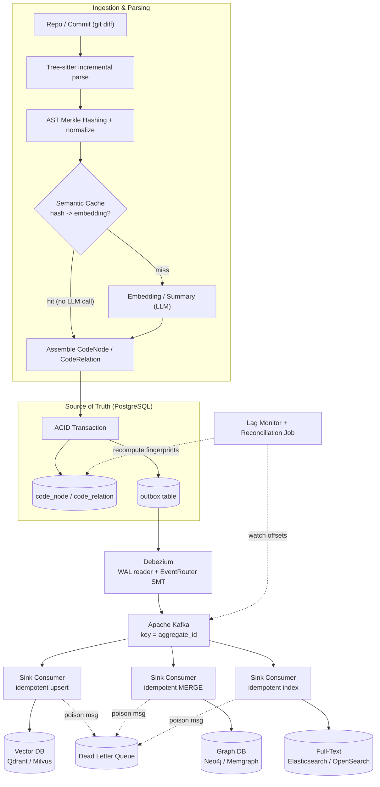
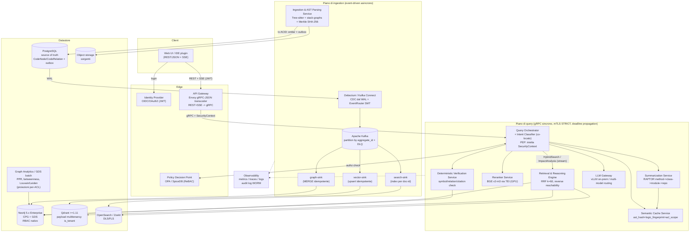

# Architecture Design Document — Enterprise Code Intelligence (ECI)
## Sistema RAG distribuito su architettura a microservizi — Documento consolidato (Moduli 1–4)

**Versione:** 1.0 (consolidata) · **Data:** 31 luglio 2026 · **Lingua:** italiano (identificatori, schemi, script e contratti in inglese come da standard)

---

## Contesto globale di progetto

**Obiettivo.** Progettare la soluzione e produrre le sezioni dell'ADD per un sistema "Enterprise Code Intelligence" RAG distribuito su architettura a microservizi.

**Requisiti macro e vincoli di scala.**
- **Scale & Complexity** — il sistema deve fare ingestion, indicizzazione e reasoning su repository monolitiche o multi-repo da diversi milioni di righe di codice (LoC), caratterizzate da forte accoppiamento e dipendenze annidate multi-livello.
- **Core Architecture** — GraphRAG + Hybrid Storage (Vector DB, Graph DB, Full-Text Search) coordinati via CDC (Change Data Capture) e transactional outbox.
- **Domain Extensibility** — architettura e schema dati nativamente estensibili per supportare in futuro non solo il codice sorgente, ma anche altri domini aziendali (documentazione tecnica, knowledge base strutturate, compliance/legal).

## Struttura del documento e registro dei deliverable

| Modulo | Titolo | Deliverable |
|---|---|---|
| 1 | Data Ingestion, Parsing & Hybrid Storage Architecture | D1 — Diagramma Mermaid pipeline CDC/dual-write · D2 — JSON Schema (Draft-07) CodeNode/CodeRelation · D3 — Schema Cypher Neo4j |
| 2 | Advanced Retrieval, Agentic Reasoning & Verification Layer | D4 — Diagramma di sequenza Mermaid (impact analysis end-to-end) · D5 — Modulo Python `hybrid_graph_vector_search` |
| 3 | Architettura a Microservizi, API Contracts & Security | D6 — Diagramma dei componenti Mermaid · D7 — Contratto Protobuf 3 `eci.retrieval.v1` |
| 4 | Tech Stack, Kubernetes Deployment, Observability & Cost Matrix | D8 — Diagramma di deployment K8s Mermaid · D9 — Matrice costi/prestazioni |

---
---

# MODULO 1 — Data Ingestion, Parsing & Hybrid Storage Architecture

> Documento prescrittivo di dettaglio. Identificatori di codice, schemi e script in inglese; prosa tecnica in italiano. Le scelte architetturali sono fondate su fonti tecniche 2025–2026 e su sistemi di code intelligence reali (GitHub Blackbird/stack-graphs, Meta Glean, Sourcegraph SCIP, CocoIndex, Joern). Dove una fonte è di natura vendor/marketing e non un benchmark indipendente, è segnalato esplicitamente.

---

## 1. Data Ingestion, Parsing & AST Representation

### 1.1 Superamento del chunking testuale

Il chunking testuale a finestra fissa (fixed-size / sliding window, es. `RecursiveCharacterTextSplitter`) è strutturalmente inadeguato su codebase multi-milione di LoC perché ignora i confini sintattici: spezza funzioni a metà corpo, separa la firma dall'implementazione e scarta il contesto di classe/import necessario a un agente per usare correttamente un simbolo. La ricerca **cAST** (Zhang et al., 2025, EMNLP Findings, "Enhancing Code Retrieval-Augmented Generation with Structural Chunking via Abstract Syntax Tree") dimostra che il chunking strutturale AST-aware — che spezza ricorsivamente i nodi AST grandi e fonde nodi fratelli rispettando un budget dimensionale — riduce la frammentazione semantica e migliora la qualità di generazione. Adottiamo quindi il chunking strutturale come default, con **budget misurato in caratteri non-whitespace** (non in righe): due segmenti con identico numero di righe possono contenere quantità di codice molto diverse (un import a riga singola vs un corpo di classe), quindi la metrica per carattere riflette il contenuto reale e non la formattazione incidentale.

**Nota di onestà epistemica.** Le evidenze non sono unanimi. Lo studio "Practical Code RAG at Scale: Task-Aware Retrieval Design Choices under Compute Budgets" (arXiv 2510.20609, 2025) riporta che il line-splitting semplice ottiene un vantaggio prestazionale lieve ma consistente rispetto allo splitting structure-aware su alcuni task, con il beneficio aggiuntivo di semplicità implementativa e agnosticismo linguistico; suggerisce inoltre che la dimensione del chunk vada regolata dinamicamente sulla finestra di contesto del modello di generazione anziché fissata. La nostra decisione (structure-aware come default) resta valida per il dominio target — reasoning multi-hop e cross-file su dipendenze annidate — ma **il chunk size è reso configurabile per linguaggio e per modello**, non hard-coded.

Decisione di fondo: superiamo il chunk come *unità concettuale primaria*. Il codice viene modellato come **grafo** (AST → Call Graph → Dependency Graph → Code Property Graph) e il chunk testuale diventa un artefatto derivato (payload per l'embedding), non l'entità di riferimento del retrieval.

### 1.2 Tree-sitter: parsing incrementale a scala enterprise

Tree-sitter è la libreria di parsing incrementale scelta come front-end. Proprietà rilevanti:

- **Parsing incrementale reale**: dopo un edit, il nuovo albero condivide la porzione non modificata del vecchio albero; la costruzione del nuovo syntax tree è quindi rapida e a basso consumo di memoria. Su un commit, solo le porzioni cambiate dei file interessati richiedono re-parsing e re-indicizzazione — proprietà usata in produzione nella pipeline di indicizzazione di GitHub.
- **Error recovery**: inserisce nodi `(ERROR)` per gli span non riconosciuti e `(MISSING token_type)` per elementi attesi ma assenti, mantenendo l'analisi funzionale anche su codice sintatticamente invalido — condizione frequente nell'ingestion di rami in sviluppo.
- **Runtime in C11 dependency-free**, engine in Rust/C, grammatiche riusabili. L'organizzazione ufficiale `tree-sitter` su GitHub mantiene circa 23 grammatiche di prima parte; bundle community come `tree-sitter-language-pack` estendono la copertura oltre 300 linguaggi, per cui la copertura effettiva per un sistema enterprise multi-linguaggio è ampiamente sufficiente.

Riferimento reale a scala: **Codebase-Memory** (arXiv 2603.27277) indicizza il kernel Linux (28 M LoC, 75K file) producendo 2,1 M nodi e 4,9 M archi in circa 3 minuti; il re-indexing incrementale via confronto di content-hash XXH3 ottiene circa **4× di speedup** rispetto al re-indexing completo.

Limite da compensare: Tree-sitter produce Concrete/Abstract Syntax Tree ma **non** risolve i simboli né inferisce i tipi; va integrato con un layer di name resolution (§1.4).

### 1.3 Da AST a CPG: AST, CFG, PDG, Call Graph e loro complementarità

- **AST** (Abstract Syntax Tree): struttura sintattica gerarchica. Rappresenta fedelmente la forma del codice, ma rende difficile trovare dipendenze di dato tra statement.
- **CFG** (Control Flow Graph): percorsi di esecuzione possibili tra basic block.
- **PDG** (Program Dependence Graph): dipendenze di controllo e di dato tra statement.
- **Call Graph** (CG): relazioni di chiamata inter-procedurali.
- **CPG** (Code Property Graph): struttura unificata introdotta da **Yamaguchi et al. (2014, IEEE S&P, "Modeling and Discovering Vulnerabilities with Code Property Graphs")** che fonde AST, CFG e PDG (e, in molte implementazioni, il CG) in un unico grafo diretto, etichettato e attribuito, formalmente `g = (V, E, λ, μ)` con nodi `V` derivati dall'AST ed archi `E` partizionati in `E_ast`, `E_cf` (control flow) ed `E_pd` (program dependence). Consente query che nessuna singola rappresentazione può soddisfare — es. "ogni percorso in cui input utente raggiunge una query DB senza passare da un sanitizer". La combinazione AST+CFG+PDG permise storicamente di rilevare 10 vulnerabilità su 12 nel kernel Linux (2012).

Strumento di riferimento: **Joern**, con linguaggio di query **CPGQL** e storage in-memory graph (OverflowDB); a differenza di CodeQL che usa un DB relazionale. Joern memorizza il CPG a **livello di nodo AST**, il che a scala fa esplodere il conteggio nodi/archi (in un esempio di letteratura, ~100 nodi e ~460 archi per un singolo frammento), degradando la traversal. Da qui la scelta di **CPG compressi a livello di statement** proposta in arXiv 2406.08098 ("Scalable Defect Detection via Traversal on Code Graph"), che memorizza il codice a livello di statement rendendo l'AST di dettaglio un attributo dello statement.

**Decisione architetturale.** Costruiamo un **CPG a granularità di statement/dichiarazione** (non a livello di ogni nodo AST) per contenere il footprint del Graph DB. L'AST di dettaglio viene serializzato come attributo sul nodo statement; come nodi di primo livello nel Graph DB si materializzano solo le entità query-rilevanti (`File`, `Module`, `Class`, `Interface`, `Method`/`Function`, `Parameter`, `Field`, `CallSite`), riducendo di ordini di grandezza il grafo persistente rispetto al CPG AST-completo di Joern.

### 1.4 Risoluzione dei simboli multi-linguaggio (cross-file / cross-repo)

Tree-sitter va completato con name resolution precisa. Opzioni valutate:

- **SCIP** (Sourcegraph Code Intelligence Protocol): schema Protobuf centrato su ID simbolo human-readable, che sostituisce LSIF eliminando la dipendenza dagli opaque global ID di LSIF (i quali impongono un ordinamento rigido nell'aggiunta dei simboli, complicano i cicli di dipendenza e rendono difficile aggiornare l'indice per un sottoinsieme di documenti). SCIP fornisce riferimenti cross-repository *compiler-accurate* e *version-aware* (gli indexer `scip-python`, `scip-java`, `scip-typescript`, `scip-clang` riusano i type checker nativi come Pyright). **Limite critico** per il nostro caso: gli indexer SCIP sono **non file-incremental** — la modifica di un singolo file richiede in genere di rieseguire l'indexer sull'intero progetto — e sono accoppiati al build system (tsconfig.json, build.gradle); per repo medi (10k+ file) l'indicizzazione può richiedere minuti, rendendo impratico l'update incrementale real-time.
- **stack-graphs** (GitHub, van Antwerpen et al., arXiv 2211.01224, "Stack graphs: Name resolution at scale"): estensione degli scope graphs di Visser et al.; alimenta la *Precise Code Navigation* di GitHub. La risoluzione di un riferimento è un path-finding sul grafo. Progettato esplicitamente per name resolution **incrementale** a scala (milioni di repo, migliaia di push/minuto).

**Decisione.** Adottiamo **stack-graphs come modello di name resolution incrementale primario** (coerente con l'ingestion delta-driven del §1.6), con **SCIP come formato di interscambio** quando un indexer di linguaggio precise è già disponibile nel build e serve navigazione cross-repo compiler-accurate. La risoluzione produce archi `CALLS`, `IMPORTS`, `EXTENDS`/`IMPLEMENTS`, `DEPENDS_ON`, `REFERENCES`, `OVERRIDES` cross-file e cross-repo materializzati nel Graph DB, con il `symbol_id` conservato sul nodo per il lookup diretto.

### 1.5 Implicazioni prestazionali a scala multi-milione di LoC

- **Sharding**: partizionamento del lavoro di parsing per repo e per modulo (unità di ownership). Il grafo cross-repo viene ricomposto via archi di risoluzione simboli. **GitHub Blackbird** shard-a l'indice per **Git blob object ID** (SHA-1 del contenuto del blob), ottenendo (a) deduplicazione — blob identici hanno lo stesso ID e vengono indicizzati una sola volta — e (b) distribuzione di carico uniforme che evita hot shard. Adottiamo lo stesso principio content-addressed per lo sharding e per la cache (§1.6).
- **Parallelizzazione**: worker pool di parsing per file/translation unit. L'error recovery di Tree-sitter e la **fault-isolation per unità** (una TU che fallisce non blocca le altre, come in `scip-clang`) permettono pipeline robuste; Codebase-Memory usa parallel worker pool sullo stesso principio.
- **Memory footprint**: CPG a livello di statement + AST serializzato come attributo; il grafo di primo livello resta ordini di grandezza più piccolo del CPG AST-completo.
- **Costo di indicizzazione O(changes) e non O(repository)**: principio esplicito di **Glean (Meta)**. Su monorepo con alto tasso di cambiamento, il re-indexing monolitico è escluso ("l'indice è perennemente obsoleto"); Glean processa solo i delta tramite uno **stack di database** in cui ogni layer aggiunge o nasconde fatti in modo non distruttivo rispetto ai layer sottostanti (`glean create --repo <new> --incremental <old> --exclude A,B,C`). La nostra pipeline segue lo stesso obiettivo asintotico.

### 1.6 Delta Indexing via AST Node Hashing (Merkle-style)

Obiettivo: a ogni commit ricalcolare embedding/summary **solo** per il codice effettivamente modificato, portando a **ZERO** le chiamate LLM ridondanti sui sottoalberi invariati.

#### 1.6.1 Hashing Merkle dei sottoalberi AST

Per ogni nodo AST si calcola un hash **SHA-256** in stile Merkle-tree, bottom-up:

```
H(node) = SHA256( normalize(node.type)
                  || normalize(node.significant_tokens)
                  || H(child_1) || H(child_2) || ... || H(child_n) )
```

- I nodi foglia (token) sono hashati dal contenuto normalizzato.
- I nodi interni combinano il proprio tipo con gli hash dei figli in ordine. Proprietà Merkle: **qualunque modifica di una foglia cambia l'hash del nodo e si propaga bottom-up fino alla radice** della funzione/file (un cambiamento di qualsiasi leaf cambia la root).
- L'hash della radice di un metodo/funzione diventa la **chiave di cache** dell'unità semantica.

#### 1.6.2 Normalizzazione pre-hash

Prima dell'hashing si applica una normalizzazione canonica per massimizzare i cache hit su codice semanticamente invariato:

- **Whitespace / formattazione**: rimosso. Un edit puramente di formattazione non deve invalidare l'embedding.
- **Commenti**: esclusi dall'hash "semantico" del codice. Poiché però docstring e commenti sono rilevanti per il retrieval, si mantiene un **secondo fingerprint `doc_hash`** che alimenta un embedding docstring-aware separato.
- **Identificatori**: due regimi selezionabili **per tipo di nodo**:
  - *identity-preserving* (default per `Method`/`Class`/API pubbliche, la cui semantica dipende dal nome);
  - *alpha-renaming–normalized* (per variabili locali, dove la rinomina non altera la semantica) → abilita cache hit su refactoring di sole variabili locali.

**Nota di ingegneria (community/vendor insight, non benchmark indipendente).** Un esperimento pubblico documenta che usare l'hash SHA-256 come chiave di *similarità semantica* diretta dà 0% di hit rate, mentre un embedding (MPNet) dà ~87,5%. La lezione: **SHA-256 va usato per l'identità esatta** (invarianza strutturale post-normalizzazione), non per la similarità; la similarità semantica resta compito dell'embedding. Il nostro design rispetta esattamente questa separazione.

#### 1.6.3 Semantic Cache: mapping hash → embedding/summary

Struttura (chiave → valore):

```
key   = ast_subtree_hash (SHA-256, post-normalize)  +  logic_fingerprint
value = { embedding_ref, summary, model_id, embedding_dim, created_at, ttl }
```

**Regola di riuso** (mutuata dai sistemi di incremental indexing reali, in particolare **CocoIndex**, incremental engine con core in Rust su Tokio, integrazione nativa Tree-sitter e stato interno in LMDB): il riuso dipende dalla domanda "*did anything the function depends on change?*". La cache riduce ogni input a un **fingerprint deterministico**; se la chiave combacia, l'output cached (embedding) viene restituito **senza ricomputazione**. Citazione documentale: *"when the embedding step sees the same chunk text and the same logic, its fingerprint is unchanged, and the prior embedding is returned without recomputation."*

**Il fingerprint include anche logica e parametri** della trasformazione (modello di embedding, versione del prompt di summary). Citazione: *"if the changed part is the embedding logic itself, we will recompute the embeddings for everything."* Questo si ottiene concatenando un `logic_fingerprint` alla chiave di cache — così un upgrade del modello di embedding invalida correttamente l'intera cache.

**Separazione identità/freschezza** (pattern CocoIndex): l'identificatore stabile (path/PK/`symbol_id`) va nella chiave; un controllo di freschezza economico (git blob id / mtime) precede quello costoso (hash del sottoalbero). Solo se il check economico fallisce si ricalcola l'hash. Analogo al "source content fingerprinting + fast collapse" con cui l'engine salta dati invariati senza leggere l'intera sorgente.

Il beneficio economico è diretto: un modello di embedding a pagamento non viene invocato per i sottoalberi invariati. Come sintetizza la documentazione di CocoIndex per il caso codice, *"a one-line edit re-embeds one chunk, not the repo"*. (Le cifre quantitative di riduzione costi diffuse in materiale marketing — es. "10× fewer LLM calls", "90% reduction" — vanno trattate come *vendor claim* non verificati indipendentemente; il meccanismo fingerprint+lineage è invece documentato ufficialmente.)

#### 1.6.4 Propagazione bottom-up e invalidazione selettiva

Su ogni commit:
1. `git diff` identifica i file modificati (interazione con commit hook / CI, §1.6.6).
2. Tree-sitter re-parsa **incrementalmente** i file cambiati.
3. Si ricalcolano gli hash Merkle bottom-up: cambiano solo gli hash sul percorso dai nodi modificati alla radice.
4. Per ogni unità semantica (metodo/funzione) il cui hash **non** è cambiato → **cache hit**, nessuna chiamata LLM.
5. Per le unità con hash mutato → si ricomputano embedding/summary e si aggiornano gli storage (§2).

L'invalidazione è **selettiva** (solo le entità con fingerprint mutato). La **lineage tracking** — traccia di quali righe dell'indice derivano dalla versione precedente del documento — garantisce la rimozione delle versioni stale nei sink. Vantaggio rispetto ad approcci basati su *replay* della trasformazione sulla versione precedente dell'input: l'approccio a lineage è robusto anche a trasformazioni **non deterministiche o aggiornate** (citazione CocoIndex: *"it's robust to transformation logic non-determinism and changes"*), mentre il replay funziona solo con logica pienamente deterministica e mai upgradata.

#### 1.6.5 Gestione rinomini / spostamenti file

- **File rename/move**: `git diff -M` rileva i rename con similarity score. Poiché la chiave di cache primaria è l'hash del sottoalbero (**content-addressed**) e non il path, un file rinominato senza modifiche di contenuto produce **cache hit totale**: nessun re-embedding, si aggiorna solo path/provenance nel nodo. È lo stesso principio della deduplicazione per blob object ID di GitHub Blackbird.
- **Spostamento di codice tra file** (move di una funzione): l'hash del sottoalbero della funzione resta invariato → cache hit; cambiano solo gli archi `CONTAINS` (File→Method) e la provenance.

#### 1.6.6 Interazione con git, TTL e garbage collection

- **Commit hook / CI**: la pipeline si aggancia a webhook post-push o a un file watcher (Codebase-Memory usa un file watcher che triggera re-indexing incrementale). L'evento porta lo SHA del commit e la lista dei path cambiati.
- **CDC push-based vs full-scan**: dove la sorgente offre change-log (analogo al push-change di CocoIndex su Google Drive) si computa sul diff; altrimenti si esegue un full-scan metadata-based confrontando lo stato corrente col precedente (universale ma più costoso). Le ottimizzazioni source-specific (listare le entry più recenti) non catturano le eliminazioni e vanno completate dal confronto di stato.
- **TTL**: ogni voce ha un TTL per invalidare summary dipendenti da contesto esterno non catturato dal solo hash. Limite noto: il TTL è insufficiente per dati a cambiamento molto rapido, quindi è **complemento** e non sostituto dell'invalidazione per hash.
- **Garbage collection**: le voci non più referenziate da alcun nodo vivo del CPG (dopo delete/rename) vengono raccolte in background; la lineage tracking fornisce il reference-counting hash→nodo. La tabella outbox e la tabella `processed_events` vanno anch'esse purgate periodicamente per evitare crescita illimitata (§2.2).

**Sistemi reali di riferimento**: Glean (indicizzazione incrementale O(changes) con stack di DB); Sourcegraph SCIP (indicizzazione precise, formato Protobuf); GitHub Blackbird/stack-graphs (sharding per blob ID, name resolution incrementale); CocoIndex (fingerprint cache + lineage tracking, core Rust/Tokio, Tree-sitter nativo, target pgvector/LanceDB/Neo4j/Kuzu).

---

## 2. Hybrid Storage & Consistenza Distribuita

### 2.1 Ruolo dei tre storage e retrieval ibrido

| Storage | Cosa memorizza | Query servita |
|---|---|---|
| **Vector DB** (Qdrant / Milvus) | Embedding densi di chunk AST-aware, summary, docstring; payload con `code_node_id`, `domain`, provenance | Semantic similarity (ANN/HNSW), ricerca per intento |
| **Graph DB** (Neo4j / Memgraph) | CPG a livello statement: nodi File/Module/Class/Method + archi CALLS/IMPORTS/EXTENDS/IMPLEMENTS/CONTAINS/DEPENDS_ON | Graph traversal multi-hop (impact analysis, call chain, dependency reasoning) |
| **Full-Text Search** (Elasticsearch / OpenSearch) | Testo sorgente, identificatori, simboli; indice n-gram/trigram | Keyword / exact match, regex, symbol search |

**Fusione dei risultati — Reciprocal Rank Fusion (RRF).** Le liste ordinate dei tre retriever si combinano con RRF, che opera sui **rank** e non sugli score grezzi, evitando la calibrazione tra scale eterogenee (dense vs BM25 vs graph score):

```
RRF(d) = Σ_r  1 / (k + rank_r(d))
```

Il valore di smoothing **k = 60** è quello introdotto e fissato sperimentalmente da **Cormack, Clarke & Büttcher, "Reciprocal Rank Fusion outperforms Condorcet and individual rank learning methods", SIGIR '09 (ACM, DOI 10.1145/1571941.1572114)**, dove RRF è mostrato superiore al Condorcet fusion e ai metodi di rank learning individuali. RRF è robusto a outlier e a distribuzioni di score incompatibili. Alcuni sistemi usano `k` inferiori (es. `k=10`) per pesare di più le prime posizioni; il valore va tarato sul dominio.

Flusso di retrieval ibrido per code RAG multi-hop:
1. **Vector search** per intento semantico → *seed nodes*;
2. **Graph traversal** dai seed per espandere il sottografo di dipendenze (chiamanti/chiamati, catene di import, impatto);
3. **Full-text** per ancorare identificatori/simboli esatti (nomi che l'embedding denso può "collassare");
4. **fusione RRF** delle tre liste;
5. re-ranking cross-encoder opzionale sul top-k fuso.

**Criteri di scelta enterprise.**

- **Vector DB — Qdrant vs Milvus.** Milvus ha architettura modulare Kubernetes-native (proxy, coordinator, storage node separati; MinIO/etcd) progettata per scala **miliardaria** e multi-tenant isolation, con partitioning a livello di collection e sharding per index node: è la scelta quando i vettori eccedono la capacità di un singolo nodo. Qdrant (core Rust) è più leggero e semplice da operare, con filtering-first performante — l'approccio **ACORN** integra il filtro di metadati nella traversal HNSW, mantenendo query veloci anche quando il filtro elimina il 99% dei candidati — e frugale in memoria (milioni di vettori su istanze piccole). La compressione **TurboQuant**, introdotta in Qdrant 1.18 (rilascio 11 maggio 2026) come algoritmo rotation-based di Google Research, secondo la fonte Qdrant *"delivers similar recall at double the compression ratio"* rispetto alla scalar quantization (che comprime ~4×), rendendo realistico un ~8× in configurazioni aggressive. **Decisione**: **Qdrant come default** — il filtering per `domain`/`repo`/provenance è centrale nel nostro payload — con migrazione a **Milvus** solo quando l'architettura distribuita miliardaria diventa requisito effettivo (indicativamente oltre ~100 M vettori o con esigenza di sharding multi-nodo), non ottimizzazione prematura.
- **Graph DB — Neo4j vs Memgraph.** Memgraph (in-memory, C++, openCypher) offre latenze inferiori su query di espansione K-hop quando il dataset entra in RAM (i benchmark *vendor* Memgraph riportano vantaggi molto elevati su expansion 1-hop — es. 1,09 ms vs 27,96 ms — da leggere con cautela metodologica, essendo prodotti dal fornitore). Neo4j (JVM, **index-free adjacency**, storage on-disk con page cache) è più maturo su clustering HA (Raft, secondaries per read-scaling), Fabric, libreria **GDS (Graph Data Science)** e su grafi persistenti multi-TB che eccedono la RAM. **Decisione**: **Neo4j 5.x come default** per il CPG persistente enterprise — un CPG su milioni di LoC eccede tipicamente la RAM e servono GDS/clustering/HA — con **Memgraph** come opzione per sottografi "caldi" a bassa latenza in scenari streaming.
- **Full-Text — Elasticsearch vs OpenSearch.** Entrambi Lucene-based. **OpenSearch 2.19 (rilasciato l'11 febbraio 2025)** ha introdotto RRF nativo tramite lo `score-ranker-processor` nel Neural Search plugin (la `normalization-processor` min_max/L2 era già in 2.10, settembre 2023), sotto licenza Apache 2.0 — utile per fondere neural + k-NN + Boolean lato motore. Per code search literal + regex moderata a scala <5 TB è adeguato un motore trigram/ngram (**Zoekt**, mantenuto da Sourcegraph) o un managed OpenSearch/Elastic Cloud con tokenizer ngram; il custom engine trigram-sharded stile **Blackbird** (scritto in Rust, 640 query/s, indicizzazione ~120.000 documenti/s, indice sharded per blob ID) si giustifica solo a QPS molto elevati e su corpora enormi.

### 2.2 Architettura CDC & Eventual Consistency

Il problema è il **dual-write**: scrivere atomicamente su Vector DB, Graph DB e Search DB è impossibile senza transazioni distribuite, che i broker come Kafka non supportano via 2PC/XA e che comunque degradano disponibilità (CAP) e performance. La soluzione prescritta è **Transactional Outbox + CDC**, che converte il dual-write in **un solo write locale atomico**.

#### 2.2.1 Source of truth + outbox atomica

- Un **DB relazionale (PostgreSQL)** è la source of truth per le entità `CodeNode`/`CodeRelation`.
- Nella **stessa transazione ACID** si scrivono (a) la mutazione dell'entità e (b) l'evento nella tabella `outbox`. Un solo write locale → zero possibilità di disallineamento tra dato ed evento (*"one ACID transaction, zero possible inconsistency"*).

```sql
BEGIN;
  INSERT INTO code_node (id, domain, node_type, ast_hash, payload, version)
         VALUES (:id, 'code', 'Method', :ast_hash, :json, :version)
  ON CONFLICT (id) DO UPDATE SET ast_hash = EXCLUDED.ast_hash,
         payload = EXCLUDED.payload, version = EXCLUDED.version;
  INSERT INTO outbox (id, aggregate_type, aggregate_id, event_type, payload, created_at)
         VALUES (gen_random_uuid(), 'CodeNode', :id, 'UPSERT', :json, now());
COMMIT;
```

#### 2.2.2 Debezium legge il WAL e pubblica su Kafka

**Debezium** (connettore Postgres) taglia il **WAL** (write-ahead / transaction log) — operazione leggera, senza polling né carico di query sul DB, con ordering naturale preservato dal log e latenza near-realtime (millisecondi). La **EventRouter SMT** instrada gli eventi ai topic in base ad `aggregate_type` e usa `aggregate_id` come **chiave Kafka**:

```json
{
  "connector.class": "io.debezium.connector.postgresql.PostgresConnector",
  "table.include.list": "public.outbox",
  "transforms": "outbox",
  "transforms.outbox.type": "io.debezium.transforms.outbox.EventRouter",
  "transforms.outbox.route.by.field": "aggregate_type",
  "transforms.outbox.table.field.event.key": "aggregate_id"
}
```

#### 2.2.3 Topic / partitioning e ordering

- Partitioning **per chiave = `aggregate_id`** (id entità): garantisce ordering per entità — tutti gli eventi di uno stesso `CodeNode` finiscono sulla stessa partizione e quindi sono ordinati. Kafka garantisce ordine **solo entro la partizione**; eventi con `aggregate_id` diversi vanno su partizioni diverse (e non sono globalmente ordinati, il che è accettabile perché l'idempotenza dei sink e il versioning risolvono i riordini cross-entità).
- **Hot partition**: se una chiave molto "toccata" (es. un file enorme) satura una partizione, si mitiga con repartitioning più fine o con un Parallel Consumer.

#### 2.2.4 Sink consumer idempotenti, delivery semantics, retry/DLQ

- **Semantica di delivery**: outbox + CDC fornisce **at-least-once** (il relay può ripubblicare dopo un crash tra publish e commit dell'offset). Debezium di per sé **non** deduplica. L'**exactly-once** è ottenibile solo via Kafka Connect EOS (**KIP-618**, GA in Apache Kafka **3.3.0**, ottobre 2022), che poggia sulle transazioni Kafka, al costo di maggiore latenza e coordinamento. **Decisione**: **at-least-once + consumer idempotenti** — lo standard di settore, descritto come "gold standard" (outbox + idempotent consumer).
- **Idempotenza per sink**:
  - *Vector DB*: **upsert** per `code_node_id` deterministico; la ricomputazione dello stesso embedding è già soppressa a monte dalla Semantic Cache.
  - *Graph DB*: `MERGE` Cypher su chiave stabile (idempotente per costruzione).
  - *Search DB*: index/update per document id deterministico.
  - Deduplicazione: `event_id` (UUID) tracciato in una tabella/inbox `processed_events` (pattern check-processed → apply → mark-processed) per scartare i duplicati sotto at-least-once.
- **Retry/backoff**: retry con backoff esponenziale per errori transienti; **commit dell'offset solo dopo processing riuscito** (auto-commit disabilitato).
- **DLQ**: i messaggi permanentemente non processabili vanno in un **dead-letter topic** dedicato per triage, isolandoli dal flusso e proteggendo il throughput.

#### 2.2.5 Monitoraggio del lag e riconciliazione

- **Consumer lag** = log-end offset − committed offset, per partizione (metriche JMX `records-lag-max`/`records-lag-avg`, `kafka-consumer-groups.sh --describe`, exporter Prometheus, Burrow). **Alert** quando il lag supera una soglia (indicativamente >10% del throughput): un outbox in ritardo rallenta l'intero sistema event-driven, e i rebalance frequenti generano spike di lag da monitorare.
- **Riconciliazione periodica**: un job ricalcola i fingerprint dal source of truth Postgres e li confronta con lo stato dei sink, ripubblicando gli eventi mancanti/divergenti (recupero da eventuale perdita o disallineamento).
- **Purge**: garbage collection periodica di `outbox` e `processed_events` per evitare crescita illimitata.

### 2.3 Data Schema Estensibile (agnostico di dominio)

Principio: **entità generica a nodo con discriminatore di dominio/tipo**, proprietà comuni + estensioni per dominio, relazioni tipizzate generiche, versioning e provenance nativi. Lo stesso schema serve nodi di codice (`Class`, `Method`, `File`, `Module`) e domini futuri (`Doc`, `Legal`, `Compliance`, `Contract`) **senza migrazione strutturale** — solo aggiunta di enum e di sotto-schemi di estensione.

- `domain` (enum: `code`, `doc`, `legal`, `compliance`, `contract`) + `node_type` (discriminatore fine).
- `common`: `id`, `name`, `ast_hash`/`content_hash`, `embedding_ref`, `provenance`, `versioning`.
- `ext`: oggetto polimorfico validato per dominio. Best practice JSON Schema: **discriminated union** via `oneOf`/`if-then` + proprietà `const` discriminante — pattern riconosciuto dai validatori (es. Ajv) che *short-circuita* dopo il match del discriminatore.
- Relazioni generiche `CodeRelation` con `rel_type` tipizzato ed estendibile (incluse `DERIVED_FROM`, `GOVERNED_BY`, `CITES` per i domini non-code).

---

## Deliverable D1 — Diagramma Mermaid: CDC & pipeline di Dual-Write asincrono



---

## Deliverable D2 — JSON Schema (Draft-07): entità agnostiche `CodeNode` & `CodeRelation`

```json
{
  "$schema": "http://json-schema.org/draft-07/schema#",
  "$id": "https://eci.enterprise.local/schemas/hybrid-graph.json",
  "title": "Enterprise Code Intelligence - Agnostic Graph Entities",
  "type": "object",
  "definitions": {
    "domainEnum": {
      "type": "string",
      "enum": ["code", "doc", "legal", "compliance", "contract"]
    },
    "sha256": {
      "type": "string",
      "pattern": "^[a-f0-9]{64}$"
    },
    "provenance": {
      "type": "object",
      "required": ["repo", "commit_sha", "path", "ingested_at"],
      "properties": {
        "repo": { "type": "string" },
        "commit_sha": { "type": "string", "pattern": "^[a-f0-9]{7,40}$" },
        "path": { "type": "string" },
        "start_line": { "type": "integer", "minimum": 0 },
        "end_line": { "type": "integer", "minimum": 0 },
        "ingested_at": { "type": "string", "format": "date-time" },
        "source_system": { "type": "string" }
      },
      "additionalProperties": false
    },
    "versioning": {
      "type": "object",
      "required": ["version", "is_current"],
      "properties": {
        "version": { "type": "integer", "minimum": 1 },
        "is_current": { "type": "boolean" },
        "valid_from": { "type": "string", "format": "date-time" },
        "valid_to": { "type": ["string", "null"], "format": "date-time" },
        "supersedes": { "type": ["string", "null"] }
      },
      "additionalProperties": false
    },
    "embeddingRef": {
      "type": "object",
      "required": ["vector_id", "model_id", "dim"],
      "properties": {
        "vector_id": { "type": "string" },
        "model_id": { "type": "string" },
        "dim": { "type": "integer", "minimum": 1 },
        "logic_fingerprint": { "$ref": "#/definitions/sha256" }
      },
      "additionalProperties": false
    },
    "codeExtension": {
      "type": "object",
      "required": ["node_type"],
      "properties": {
        "node_type": {
          "type": "string",
          "enum": ["File", "Module", "Package", "Class", "Interface",
                   "Method", "Function", "Parameter", "Field", "CallSite"]
        },
        "language": { "type": "string" },
        "signature": { "type": "string" },
        "visibility": { "type": "string", "enum": ["public", "private", "protected", "internal"] },
        "symbol_id": { "type": "string", "description": "SCIP / stack-graphs symbol id" },
        "doc_hash": { "$ref": "#/definitions/sha256" }
      },
      "additionalProperties": false
    },
    "docExtension": {
      "type": "object",
      "required": ["node_type"],
      "properties": {
        "node_type": { "type": "string", "enum": ["Document", "Section", "Paragraph"] },
        "title": { "type": "string" },
        "mime_type": { "type": "string" }
      },
      "additionalProperties": false
    },
    "legalExtension": {
      "type": "object",
      "required": ["node_type"],
      "properties": {
        "node_type": { "type": "string", "enum": ["Contract", "Clause", "Policy", "Regulation"] },
        "jurisdiction": { "type": "string" },
        "effective_date": { "type": "string", "format": "date" },
        "obligation_level": { "type": "string", "enum": ["mandatory", "recommended", "prohibited"] }
      },
      "additionalProperties": false
    },
    "CodeNode": {
      "type": "object",
      "required": ["id", "domain", "name", "ast_hash", "provenance", "versioning"],
      "properties": {
        "id": { "type": "string", "pattern": "^[A-Za-z0-9_.:/#-]+$" },
        "domain": { "$ref": "#/definitions/domainEnum" },
        "name": { "type": "string" },
        "ast_hash": { "$ref": "#/definitions/sha256" },
        "content_hash": { "$ref": "#/definitions/sha256" },
        "embedding": { "$ref": "#/definitions/embeddingRef" },
        "provenance": { "$ref": "#/definitions/provenance" },
        "versioning": { "$ref": "#/definitions/versioning" },
        "ext": { "type": "object" }
      },
      "allOf": [
        {
          "if": { "properties": { "domain": { "const": "code" } } },
          "then": { "properties": { "ext": { "$ref": "#/definitions/codeExtension" } } }
        },
        {
          "if": { "properties": { "domain": { "const": "doc" } } },
          "then": { "properties": { "ext": { "$ref": "#/definitions/docExtension" } } }
        },
        {
          "if": { "properties": { "domain": { "const": "legal" } } },
          "then": { "properties": { "ext": { "$ref": "#/definitions/legalExtension" } } }
        }
      ],
      "additionalProperties": false
    },
    "CodeRelation": {
      "type": "object",
      "required": ["id", "rel_type", "from_id", "to_id", "domain"],
      "properties": {
        "id": { "type": "string" },
        "domain": { "$ref": "#/definitions/domainEnum" },
        "rel_type": {
          "type": "string",
          "enum": ["CALLS", "IMPORTS", "EXTENDS", "IMPLEMENTS", "CONTAINS",
                   "DEPENDS_ON", "REFERENCES", "OVERRIDES",
                   "DERIVED_FROM", "GOVERNED_BY", "CITES"]
        },
        "from_id": { "type": "string" },
        "to_id": { "type": "string" },
        "weight": { "type": "number" },
        "provenance": { "$ref": "#/definitions/provenance" },
        "versioning": { "$ref": "#/definitions/versioning" }
      },
      "additionalProperties": false
    }
  },
  "oneOf": [
    { "$ref": "#/definitions/CodeNode" },
    { "$ref": "#/definitions/CodeRelation" }
  ]
}
```

---

## Deliverable D3 — Schema Neo4j Cypher (5.x)

```cypher
// ============================================================
// CONSTRAINTS (uniqueness + existence) — Neo4j 5.x
// ============================================================
CREATE CONSTRAINT code_node_id IF NOT EXISTS
FOR (n:CodeNode) REQUIRE n.id IS UNIQUE;

CREATE CONSTRAINT code_node_id_exists IF NOT EXISTS
FOR (n:CodeNode) REQUIRE n.id IS NOT NULL;

CREATE CONSTRAINT code_node_domain_exists IF NOT EXISTS
FOR (n:CodeNode) REQUIRE n.domain IS NOT NULL;

CREATE CONSTRAINT file_path_unique IF NOT EXISTS
FOR (f:File) REQUIRE (f.repo, f.path) IS UNIQUE;

CREATE CONSTRAINT method_symbol_unique IF NOT EXISTS
FOR (m:Method) REQUIRE m.symbol_id IS UNIQUE;

// Native Vector type + dimension constraint (Cypher 25 / Neo4j 5.x)
CREATE CONSTRAINT emb_vector_type IF NOT EXISTS
FOR (n:CodeNode) REQUIRE n.embedding IS :: VECTOR<FLOAT32>(1536);

// ============================================================
// RANGE INDEXES
// ============================================================
CREATE RANGE INDEX code_node_ast_hash IF NOT EXISTS
FOR (n:CodeNode) ON (n.ast_hash);

CREATE RANGE INDEX code_node_domain IF NOT EXISTS
FOR (n:CodeNode) ON (n.domain);

CREATE RANGE INDEX method_name IF NOT EXISTS
FOR (m:Method) ON (m.name);

CREATE RANGE INDEX rel_commit IF NOT EXISTS
FOR ()-[r:CALLS]-() ON (r.commit_sha);

// ============================================================
// FULL-TEXT INDEXES (Apache Lucene)
// ============================================================
CREATE FULLTEXT INDEX code_fulltext IF NOT EXISTS
FOR (n:Method|Function|Class|File) ON EACH [n.name, n.signature, n.source_text];

CREATE FULLTEXT INDEX doc_fulltext IF NOT EXISTS
FOR (n:Document|Section) ON EACH [n.title, n.body];

// ============================================================
// NATIVE VECTOR INDEX (Neo4j 5.x)
// ============================================================
CREATE VECTOR INDEX code_embeddings IF NOT EXISTS
FOR (n:CodeNode) ON (n.embedding)
OPTIONS { indexConfig: {
  `vector.dimensions`: 1536,
  `vector.similarity_function`: 'cosine'
}};

// ============================================================
// NODE UPSERT (idempotent MERGE) — sink consumer
// ============================================================
MERGE (m:CodeNode:Method { id: $id })
  ON CREATE SET m.name = $name, m.ast_hash = $ast_hash,
                m.domain = 'code', m.node_type = 'Method',
                m.symbol_id = $symbol_id, m.signature = $signature,
                m.version = $version, m.is_current = true
  ON MATCH  SET m.ast_hash = $ast_hash, m.signature = $signature,
                m.version = $version, m.is_current = true;

// ============================================================
// TYPED RELATIONSHIPS (idempotent) — codebase topology
// ============================================================
MATCH (caller:Method { id: $caller_id })
MATCH (callee:Method { id: $callee_id })
MERGE (caller)-[r:CALLS]->(callee)
  ON CREATE SET r.commit_sha = $commit_sha, r.weight = 1
  ON MATCH  SET r.weight = coalesce(r.weight, 0) + 1;

MATCH (f:File { id: $file_id })
MATCH (c:Class { id: $class_id })
MERGE (f)-[:CONTAINS]->(c);

MATCH (a:Module { id: $from_mod })
MATCH (b:Module { id: $to_mod })
MERGE (a)-[:IMPORTS]->(b);

MATCH (sub:Class { id: $sub_id })
MATCH (sup:Class { id: $sup_id })
MERGE (sub)-[:EXTENDS]->(sup);

MATCH (impl:Class { id: $impl_id })
MATCH (ifc:Interface { id: $ifc_id })
MERGE (impl)-[:IMPLEMENTS]->(ifc);

MATCH (x:Module { id: $x_id })
MATCH (y:Module { id: $y_id })
MERGE (x)-[:DEPENDS_ON]->(y);

// ============================================================
// EXTENSIBILITY: Doc / Legal / Compliance domains
// ============================================================
MERGE (d:CodeNode:Document { id: $doc_id })
  ON CREATE SET d.domain = 'doc', d.node_type = 'Document', d.title = $title;

MERGE (cl:CodeNode:Clause { id: $clause_id })
  ON CREATE SET cl.domain = 'legal', cl.node_type = 'Clause',
                cl.jurisdiction = $jur;

// Cross-domain: un Method GOVERNED_BY una Clause di compliance
MATCH (m:Method { id: $m_id })
MATCH (cl:Clause { id: $clause_id })
MERGE (m)-[:GOVERNED_BY]->(cl);

// Provenance/versioning: nodo DERIVED_FROM la versione precedente
MATCH (curr:CodeNode { id: $curr_id })
MATCH (prev:CodeNode { id: $prev_id })
MERGE (curr)-[:DERIVED_FROM]->(prev);

// ============================================================
// VECTOR QUERY (Cypher 25 SEARCH clause) — hybrid retrieval seed
// ============================================================
// MATCH (n:CodeNode) SEARCH n IN (
//   VECTOR INDEX code_embeddings FOR $queryVector LIMIT 20
// ) SCORE score
// RETURN n.id, n.name, score ORDER BY score DESC;
```

---

## Note conclusive di consistenza architetturale (Modulo 1)

Lo schema logico JSON (D2), lo schema Neo4j (D3) e la pipeline CDC (D1) condividono le stesse chiavi canoniche (`id`, `ast_hash`, `domain`, `provenance`, `versioning`), garantendo che la Semantic Cache (hash→embedding), il source of truth Postgres e i tre sink (Vector/Graph/Search) restino riconciliabili in ogni istante. Il discriminatore `domain` — con `oneOf`/`if-then` + `const` lato JSON Schema e multi-label lato Neo4j — rende l'intera architettura nativamente estensibile a Doc/Legal/Compliance senza modifiche strutturali, per sola aggiunta di enum e sotto-schemi di estensione.

**Sintesi delle decisioni prescrittive del Modulo 1.**
1. Rappresentazione: **CPG a livello di statement** (non AST-node come Joern), AST serializzato come attributo; chunk AST-aware come payload derivato, con size configurabile.
2. Parsing: **Tree-sitter incrementale** + **stack-graphs** per name resolution incrementale (SCIP come interscambio).
3. Delta indexing: **Merkle hashing SHA-256** dei sottoalberi con normalizzazione per-tipo + **Semantic Cache** con `logic_fingerprint`, lineage tracking per invalidazione selettiva e deduplicazione content-addressed su rename/move → **zero chiamate LLM ridondanti**.
4. Storage: **Qdrant** (default) / Milvus (scala miliardaria); **Neo4j 5.x** (default) / Memgraph (hot subgraph); **OpenSearch/Zoekt** per full-text; fusione **RRF (k=60)**.
5. Consistenza: **Transactional Outbox + Debezium (WAL) + Kafka** con partitioning per `aggregate_id`, **at-least-once + sink idempotenti**, DLQ, monitoraggio del lag e job di riconciliazione.

**Caveat sulle fonti.** I benchmark comparativi Memgraph vs Neo4j e le cifre di riduzione costi di CocoIndex/semantic caching provengono in parte da materiale vendor/marketing e non da benchmark indipendenti: vanno validati in un PoC interno sui carichi reali prima del commitment architetturale definitivo. I meccanismi (Tree-sitter incrementale, outbox+Debezium+Kafka, RRF k=60 di Cormack et al. 2009, KIP-618, vector/full-text index nativi Neo4j 5.x) sono invece documentati da fonti primarie o ufficiali.

---
---

# MODULO 2 — Advanced Retrieval, Agentic Reasoning & Verification Layer

> Documento prescrittivo. Rigorosamente coerente con le decisioni del Modulo 1 (CPG a granularità di statement; Tree-sitter incrementale + stack-graphs/SCIP; Merkle SHA-256 + Semantic Cache con chiave `ast_hash + logic_fingerprint`; Qdrant/Neo4j 5.x/OpenSearch-Zoekt; fusione RRF k=60; Transactional Outbox + Debezium/Kafka con sink idempotenti; entità canoniche CodeNode/CodeRelation con `id, domain, ast_hash, embedding_ref, provenance, versioning`). Terminologia invariata. Identificatori di codice, schemi e script in inglese come da standard.

---

## 1. Query Complesse e Impact Analysis

### 1.1 Inquadramento del problema
La query guida — "Qual è l'impatto di ricaduta se modifico l'interfaccia X nel modulo Y?" — è una query strutturale a lungo raggio. Non è risolvibile con retrieval vettoriale flat: la risposta corretta è la chiusura di raggiungibilità inversa (reverse reachability closure) sul grafo di dipendenze del CPG, ponderata per la probabilità e la gravità della propagazione. Su repository da milioni di LoC il CPG a granularità di statement contiene decine/centinaia di milioni di CodeNode e un numero superiore di CodeRelation; il calcolo naïf della chiusura transitiva esplode combinatoriamente. Questo modulo definisce come contenere quell'esplosione mantenendo completezza controllata e come garantire che la risposta finale sia deterministicamente fondata.

### 1.2 Change Impact Analysis sul dependency/call graph
Il blast radius si calcola come attraversamento del grafo lungo gli archi inversi partendo dal nodo target. La tecnica canonica è una BFS/DFS sugli archi inversi: partendo dal simbolo modificato si segue all'indietro CALLS (chi chiama), IMPLEMENTS/EXTENDS/OVERRIDES (chi realizza/eredita il contratto), IMPORTS/DEPENDS_ON (confini di modulo). Ogni nodo raggiunto entra nel blast radius; la profondità di traversata è il parametro di controllo primario. Un livello di profondità 1 restituisce solo i dipendenti diretti; profondità 3-5 cattura i dipendenti transitivi che è utile analizzare nella pratica.

Si distinguono due chiusure:
- **Forward blast radius**: cosa il nodo modificato usa (dipendenze in uscita) — utile per capire cosa serve al nodo per compilare.
- **Backward/reverse dependency closure**: chi dipende dal nodo modificato — è la risposta all'impact analysis. Su Neo4j si materializza con una proiezione GDS a orientamento `REVERSE` (`gds.graph.project` con la mappa `{EDGE_TYPE: {orientation: 'REVERSE'}}`, che secondo la documentazione GDS corrente "reverses the orientation for all relationships"), oppure — nella nuova Cypher-projection — invertendo source/target nella `MATCH`.

Sul piano canonico CodeNode/CodeRelation, il nodo target è identificato per `id` (o via `ast_hash` per resilienza al re-indexing); la traversata inversa produce l'insieme impattato con provenance (repo/path/righe/commit) associata a ciascun nodo.

### 1.3 Gestione dell'esplosione combinatoria del fan-out
Su grafi a milioni di archi, un `MATCH (target)<-[:CALLS*]-(caller)` non vincolato è intrattabile. Le contromisure prescritte, tutte native a Neo4j 5.x/Cypher e GDS:

1. **Limiti di profondità espliciti** su ogni pattern a lunghezza variabile (`*1..K`, con K configurabile per tipo di query, default K=4 per CALLS, K=2 per EXTENDS/IMPLEMENTS).
2. **Pruning variable-length con semantica DISTINCT**: Neo4j applica l'ottimizzazione "Pruning Var-Expand" quando la query restituisce nodi distinti, eliminando i cammini duplicati; secondo la documentazione interna di Neo4j questa ottimizzazione "can reduce execution time by orders of magnitude for queries that return distinct nodes by eliminating duplicate paths". L'impact analysis richiede l'insieme dei nodi impattati (distinti), non l'enumerazione dei cammini, quindi rientra esattamente in questo caso.
3. **Quantified Path Patterns (QPP)** di Cypher 5 con predicati inline (`WHERE`) per il pruning durante l'espansione: la documentazione Neo4j avverte che "depending on the graph, they can end up matching very large numbers of paths, resulting in a slow query performance… by using inline predicates… unwanted results will be pruned as the graph is traversed". Cypher 25 aggiunge il pruning state-aware (predicato `allReduce`) per condizioni di terminazione accumulative (es. budget di costo o profondità pesata), evitando "a huge post-filtering workload".
4. **APOC Path Expander** (`apoc.path.expandConfig`) con whitelist/blacklist di label e `uniqueness` a livello di nodo, per traversate tipizzate con vincoli quando i QPP non bastano.
5. **Cap sul fan-out per hop** (top-N vicini per nodo, ordinati per priorità — vedi §1.4) per contenere i super-nodi (utility/logging chiamati ovunque), che altrimenti dominano il blast radius con rumore.

### 1.4 Prioritizzazione dei nodi impattati con graph analytics (Neo4j GDS)
Il blast radius grezzo su codebase reali è troppo grande per essere presentato all'utente o iniettato nel contesto dell'LLM. Si prioritizza con la Neo4j Graph Data Science library, che opera su una proiezione in-memory del sottografo rilevante. Tre algoritmi, tutti in **tier production** (namespace `gds.` senza prefisso `beta`/`alpha`, con supporto `.estimate` per la stima di memoria):

- **Personalized PageRank (PPR)** seedato sul nodo modificato: assegna rilevanza ai nodi dal punto di vista del target, propagando il rank lungo gli archi. È il criterio principale per ordinare i nodi impattati. In GDS si invoca `gds.pageRank.stream(graphName, {sourceNodes: [X], maxIterations: 20, dampingFactor: 0.85})`, dove — secondo la documentazione GDS — il parametro `sourceNodes` serve "to use for computing Personalized Page Rank" e accetta node reference, node id, lista, o coppie `[nodeId, bias]`. Su proiezione a orientamento REVERSE, il PPR misura quanto ciascun dipendente è "esposto" al target.
- **Betweenness Centrality** per identificare i nodi-ponte (bridge) tra comunità di moduli: un nodo con alta betweenness sul percorso di propagazione è un punto di rottura critico. Si invoca `gds.betweenness.stream`; la documentazione GDS ne segnala il costo ("can be very resource-intensive to compute") e offre l'approssimazione via campionamento tramite il parametro `samplingSize` (definito come "the number of source nodes to consider for computing centrality scores"), riducendo il runtime su grafi grandi mentre "setting the samplingSize to the node count of the graph… will produce exact results".
- **Community Detection (Louvain/Leiden)** per raggruppare il blast radius in cluster di moduli coesi: consente di riportare l'impatto a livello di comunità ("l'impatto tocca 3 moduli: A, B, C") invece che come lista piatta di centinaia di simboli.

Lo scoring finale di priorità è una combinazione lineare normalizzata: `impact_score = w_ppr * ppr_norm + w_prox * (1/hop_distance) + w_bc * betweenness_norm`, con pesi configurabili. Questo alimenta sia il cap sul fan-out (§1.3) sia il context budgeting (§2.4). Su grafi da milioni di nodi, prima dell'esecuzione va invocato l'`.estimate` (es. `gds.pageRank.write.estimate` / `gds.graph.project.estimate`): la documentazione GDS avverte che "if the estimation shows that there is a very high probability of the execution going over its memory limitations, the execution is prohibited".

### 1.5 Propagazione per archi tipizzati: sintattico vs semantico
La propagazione non è uniforme sui tipi di arco:
- **CALLS (transitivo)**: propagazione comportamentale diretta. Una modifica alla firma/semantica di X si propaga ai chiamanti transitivi.
- **IMPLEMENTS/EXTENDS/OVERRIDES**: propagazione per polimorfismo e dynamic dispatch. Se X è un'interfaccia, modificarla impatta tutte le implementazioni concrete e i loro chiamanti attraverso il tipo statico dell'interfaccia. Questo è il caso critico della query guida: il fan-out del dynamic dispatch è spesso invisibile all'analisi puramente sintattica di CALLS, perché la call site punta al tipo dichiarato, non all'implementazione runtime.
- **IMPORTS/DEPENDS_ON**: confini di modulo/pacchetto. Segnalano ricadute a livello di build/deploy (un modulo dipendente va ricompilato/ridispiegato) più che di comportamento a runtime.

**Distinzione impatto sintattico vs semantico/comportamentale.** L'impatto *sintattico* (o strutturale) è ciò che rompe la compilazione: cambio di firma, rimozione di un simbolo, cambio di tipo. È deterministicamente calcolabile dal grafo + type-checker. L'impatto *semantico/comportamentale* è il cambiamento di comportamento a parità di firma (es. cambio di un invariante, di un valore di default, di un side-effect): non è visibile dal solo grafo delle firme e richiede analisi di data-flow/slicing (query stile Joern sul CPG che integra AST+CFG+PDG) o test comportamentali. L'ADD prescrive di etichettare ogni nodo del blast radius con `impact_kind ∈ {syntactic, behavioral, module-boundary}` derivato dal tipo di arco attraversato e dalla presenza/assenza di cambio di firma, così che la risposta distingua "rompe la compilazione" da "potrebbe cambiare comportamento".

### 1.6 Fusione Graph-guided Traversal + ricerca semantica
La strategia combina il traversal topologico su Neo4j con la ricerca semantica su Qdrant in un flusso a cinque fasi:

1. **Seed-finding vettoriale**: la query in linguaggio naturale ("interfaccia X nel modulo Y") viene embeddata e cercata su Qdrant con filtri di payload (`domain`, `repo`) per localizzare gli entry point candidati (i CodeNode che *sono* X o vi somigliano semanticamente). Il vettoriale risolve l'ambiguità del nome ("X" può esistere in più moduli) e i riferimenti concettuali.
2. **Ancoraggio al grafo**: gli entry point vettoriali vengono risolti a `node_id` esatti su Neo4j (join per `id`/`ast_hash`).
3. **Espansione topologica**: dai seed si esegue la traversata tipizzata inversa (§1.2-1.3) per costruire il blast radius.
4. **Ri-ancoraggio semantico durante la traversata**: ad ogni frontiera di espansione, i nodi candidati possono essere ri-valutati con similarità vettoriale rispetto all'intento della query per potare rami semanticamente irrilevanti (evita di seguire super-nodi utility non pertinenti).
5. **Fusione RRF (k=60)** coerente col Modulo 1: la lista dei nodi da graph-traversal (ordinata per `impact_score`) e la lista da vector-search (ordinata per similarità) sono fuse con Reciprocal Rank Fusion, `score_RRF(d) = Σ 1/(k + rank_i(d))` con k=60 (Cormack et al., SIGIR '09). Qdrant supporta nativamente RRF nella Query API via `models.FusionQuery(fusion=models.Fusion.RRF)` su `prefetch` multipli; per una fusione grafo↔vettore cross-store la si applica invece nello strato orchestratore (Deliverable D5), perché una gamba proviene da Neo4j.

**Quando prevale il grafo vs il vettoriale.** Regola prescrittiva:
- **Query strutturali/impact** (impatto, chiamanti, override, cicli di dipendenza, "chi usa"): **prevale il grafo**. Il vettoriale serve solo come seed-finder; il ranking finale è dominato dall'`impact_score` topologico. La ricerca per sola similarità ha recall basso su ragionamento multi-hop (tracciare override di metodi o dipendenze cross-modulo — limite documentato in CodexGraph, NAACL 2025), quindi non può guidare da sola l'impact analysis.
- **Query concettuali** ("dove gestiamo il retry con backoff?", "mostrami la logica di autenticazione"): **prevale il vettoriale**. Il grafo serve a espandere il contesto attorno agli hit semantici.
Il peso relativo nella fusione RRF è modulato dal classificatore di intento della query in testa alla pipeline (§2.2). Questo è l'analogo, sul dominio codice, della dualità Local Search / Global Search di Microsoft GraphRAG (Edge et al., "From Local to Global", arXiv:2404.16130): local per entità specifiche, global per sensemaking sull'intero corpus via community summaries.

---

## 2. Retrieval & Agentic Traversal

### 2.1 Hierarchical Chunking e Hierarchical Summarization
Il sistema adotta due gerarchie complementari.

**Hierarchical chunking (cAST, dal Modulo 1).** I chunk AST-aware sono già prodotti in ingestion come payload derivato del CPG, size configurabile per linguaggio/modello. Sono le foglie della gerarchia di retrieval.

**Hierarchical summarization bottom-up (approccio RAPTOR).** RAPTOR (Sarthi et al., ICLR 2024, arXiv:2401.18059) costruisce un albero di summary dal basso: embedding dei chunk, clustering (GMM su embedding ridotti con UMAP), summarization ricorsiva dei cluster fino alla radice; a query time si recupera da qualunque livello dell'albero (il metodo "collapsed tree", che considera tutti i nodi simultaneamente, risulta più efficace del "tree traversal" strato-per-strato). Gli autori riportano testualmente che "by coupling RAPTOR retrieval with the use of GPT-4, we can improve the best performance on the QuALITY benchmark by 20% in absolute accuracy". Nel dominio codice, la gerarchia non è appresa via clustering statistico ma è imposta dalla struttura del CPG: la summarization è **method → class → module → repo** lungo gli archi CONTAINS. Ogni livello produce un summary in linguaggio naturale ("cosa fa questo metodo/classe/modulo") memorizzato come attributo del CodeNode e indicizzato su Qdrant.

**Riuso della Semantic Cache (Modulo 1).** La chiave di cache è `ast_hash + logic_fingerprint`. Poiché i summary sono deterministicamente derivabili dal sottoalbero AST, la cache dei summary usa la stessa chiave: se `ast_hash` di un metodo non cambia, il suo summary non viene rigenerato (zero chiamate LLM ridondanti). La propagazione bottom-up si arresta ai sottoalberi il cui `ast_hash` è invariato tra due indicizzazioni — solo i cammini method→…→repo che contengono almeno una foglia modificata vengono ri-summarizzati. Questo mitiga il costo noto di RAPTOR (la letteratura segnala che RAPTOR "requires expensive LLM-based abstractive summarization at each internal node—making large-scale deployment prohibitively costly") sfruttando il delta indexing Merkle.

### 2.2 Pattern agentici per la navigazione del grafo di codice
L'agente naviga il CPG con un set di tool tipizzati, non con una singola query monolitica (approccio validato da CodexGraph, NAACL 2025, e RepoGraph, ICLR 2025, che riporta +32.8% relativo su SWE-bench):

| Tool | Firma logica | Backend |
|---|---|---|
| `get_node(node_id)` | metadati + summary di un CodeNode | Neo4j |
| `get_callers(node_id, depth)` | chiamanti diretti/transitivi (archi CALLS inversi) | Neo4j |
| `get_callees(node_id, depth)` | chiamati (archi CALLS diretti) | Neo4j |
| `expand_dependencies(node_id, edge_types, depth)` | traversata tipizzata generica (IMPORTS/DEPENDS_ON/EXTENDS/…) | Neo4j |
| `semantic_search(query, filters)` | seed-finding vettoriale | Qdrant |
| `read_source(node_id)` | sorgente integrale con provenance | OpenSearch/Zoekt + repo |
| `summarize_subgraph(node_ids)` | summary gerarchico di un insieme (riusa Semantic Cache) | Cache/LLM |

**ReAct (Yao et al., 2022/2023).** Loop thought → action → observation: l'agente ragiona, sceglie un tool, osserva il risultato, aggiorna lo stato. È il backbone per la navigazione dinamica: adatto quando il percorso non è noto a priori e va scoperto (es. seguire una catena di chiamate finché non si raggiunge il confine di modulo). ReAct interleaves esplicitamente reasoning e azione, aggiornando la strategia in base alle osservazioni.

**Plan-and-Solve (Wang et al., 2023).** Fase di pianificazione esplicita iniziale ("understand the problem, devise a plan, execute steps according to the plan"), poi esecuzione. Adatto a query di impact analysis multi-hop la cui struttura è nota: (1) trova X, (2) trova implementazioni di X, (3) trova chiamanti di ciascuna, (4) prioritizza, (5) verifica. Il piano riduce il vagabondaggio ma è meno reattivo ai vicoli ciechi.

**Criteri di scelta e planning ibrido (plan-then-react).** Prescrizione:
- Query **impact analysis multi-hop con struttura nota** → **Plan-and-Solve** o **plan-then-react ibrido**: un piano iniziale definisce le fasi (come sopra), ma ogni fase è eseguita con un mini-loop ReAct che gestisce l'incertezza locale (es. quante implementazioni esistono davvero). Evidenza pratica: agenti ReAct+Plan ibridi superano ReAct puro su task complessi grazie al passo di pianificazione (in un caso studio pubblico, dal 83% al 95% di task completion aggiungendo un passo di planning).
- Query **esplorative/open-ended** ("capisci come funziona questo sottosistema") → **ReAct** puro.
- Plan-and-Solve puro va usato con cautela: la letteratura segnala che la pianificazione anticipata rigida può produrre più errori silenziosi quando l'ambiente (il grafo) smentisce le assunzioni del piano.

**Controllo del loop.** Ogni agente ha: (a) **budget di passi** (max N azioni, default 15-30 per impact analysis); (b) **budget di token**; (c) **criteri di stop** (raggiunto il confine di modulo su tutti i rami; blast radius stabilizzato; nessun nuovo nodo con `impact_score` sopra soglia); (d) **gestione dei vicoli ciechi** (se un tool ritorna vuoto o già-visitato, backtrack alla frontiera precedente e prosegui su un altro ramo; deduplicazione dei nodi visitati per evitare cicli). Lo stato di visita è mantenuto lato orchestratore (non nel prompt) per non saturare il contesto.

### 2.3 Strategie di Re-ranking
Dopo la fusione RRF si applica un cross-encoder reranker. Posizionamento: **il reranker opera dopo la fusione RRF**, su un candidate set di top-50/100 nodi, riducendolo a top-k (5-10) per l'iniezione nel contesto. Un cross-encoder legge la coppia query-documento congiuntamente (full attention), producendo uno score di rilevanza più preciso della similarità bi-encoder.

**Opzioni.**
- **Managed API — Cohere Rerank 3.5** (rilasciato il 3 dicembre 2024), context length 4096 token, supporto 100+ lingue. Cohere riporta sul proprio dataset di financial services che "Rerank 3.5 performance was +23.4% better than Hybrid Search and +30.8% better than BM25". Convenienza hosted e buon NDCG generale, ma introduce latenza (benchmark di terze parti la collocano in media attorno ai ~595-603 ms) e richiede l'invio dei contenuti a un servizio esterno — problematico on-prem/enterprise per l'IP del codice sorgente.
- **Self-hosted — BGE reranker (bge-reranker-v2-m3)**: cross-encoder open-weight di BAAI, 568M parametri (architettura xlm-roberta, base bge-m3), max 512 token per coppia query-passage, ~1.1 GB in FP16, deployabile via Hugging Face Text Embeddings Inference (TEI) su GPU interna. È lo standard self-hosted; benchmark indipendenti indicano ~50 ms aggiunti per query al top-50 su GPU dedicata.

**Confronto managed vs self-hosted per vincoli enterprise.** Per Enterprise Code Intelligence su codice proprietario, l'ADD prescrive **BGE reranker self-hosted come default** (il sorgente non lascia il perimetro; nessun costo per-query; compatibilità con requisiti SOC2/ISO/on-prem), con Cohere Rerank 3.5 come opzione per deployment cloud dove l'IP non è vincolante e si vuole evitare l'ops-overhead della GPU. Il break-even di costo del self-hosting rispetto all'API managed si raggiunge a volumi di query sostenuti (dipendente da utilizzo GPU e prezzi API correnti; da rivalutare al momento del deploy).

**Re-ranking consapevole della struttura (structure-aware).** Innovazione specifica del dominio: lo score del reranker è combinato con un boost di **prossimità topologica al nodo di impatto**: `final_score = rerank_score + β * proximity_boost(node)`, dove `proximity_boost` è funzione decrescente della distanza in hop dal target dell'impact analysis e crescente nell'`impact_score` GDS (§1.4). Questo garantisce che, a parità di rilevanza semantica, i nodi topologicamente più vicini/critici al punto di modifica siano presentati per primi — allineando il ranking all'obiettivo dell'impact analysis, non solo alla similarità testuale.

### 2.4 Ottimizzazione della finestra di contesto per codebase massive
Il contesto è un budget scarso. Prescrizione di **context budgeting per sezioni**, con quote di token dedicate:

1. **Definizioni** (firme + summary dei nodi impattati top-k): quota alta, sempre incluse.
2. **Chiamanti/relazioni** (archi rilevanti in forma compatta): quota media.
3. **Summary gerarchici** (livello module/repo per il contesto globale): quota media.
4. **Sorgente integrale**: **solo per i top-k nodi** (default k=3-5), quelli con `impact_score` massimo o al centro esatto del cambiamento.

**Criterio sorgente integrale vs summary.** Includi il sorgente integrale quando: (a) il nodo è il target diretto della modifica o un suo dipendente diretto ad alto `impact_score`; (b) la query richiede verifica a livello di riga/statement; (c) c'è budget residuo. Altrimenti includi il summary gerarchico. Questo implementa il trade-off precisione/copertura noto delle strutture gerarchiche.

**Compressione/summarization selettiva e deduplicazione.** I nodi a basso rank sono rappresentati dal solo summary (compressione). I chunk duplicati o quasi-duplicati (frequenti in codice: boilerplate, overload) sono deduplicati per `node_id` e per near-duplicate embedding prima del packing.

**Packing con provenance.** Ogni frammento è impacchettato con citazione di provenance esplicita `repo/path:start_line-end_line@commit_sha` (dalla entità canonica `CodeNode.provenance` del Modulo 1), necessaria per il grounding check deterministico (§3).

**Mitigazione del lost-in-the-middle.** Liu et al. (2024, TACL, "Lost in the Middle: How Language Models Use Long Contexts") mostrano che "performance is often highest when relevant information occurs at the beginning or end of the input context, and significantly degrades when models must access relevant information in the middle". Contromisura prescritta: ordinare il packing in modo che i nodi a più alto `final_score` siano posizionati all'**inizio e alla fine** della finestra (ordinamento "a U"), relegando i nodi di contesto secondario al centro. Questo è preferito al ricorso a modelli long-context puri, coerentemente con la strategia retrieval-first del sistema.

---

## 3. Deterministic Verification & Anti-Hallucination

### 3.1 Principio
Il Verification Layer è il **gate finale deterministico**: nessuna risposta raggiunge l'utente senza essere stata incrociata con ground truth ricavata dal grafo (CodeNode/CodeRelation), dal parser (Tree-sitter) e da tool di Static Code Analysis. La verifica deterministica usa fonti di verità oggettive (il grafo, il compilatore, il parser) e non stime probabilistiche. È un principio distinto dal retrieval: anche una risposta ben recuperata può contenere allucinazioni di sintesi. La letteratura sul code generation (Liu et al., arXiv:2409.20550) conferma che una parte rilevante delle allucinazioni "can be detected by using static analysis (e.g., undefined variables) or dynamic test execution", motivando un layer deterministico.

### 3.2 Pipeline di verifica a stadi
Ogni risposta candidata dell'agente attraversa gli stadi in sequenza; un fallimento genera un esito (§3.3).

**(a) Estrazione dei claim verificabili.** Parsing strutturato della risposta LLM per estrarre: simboli citati (nomi di metodi/classi/interfacce), relazioni affermate ("A chiama B", "C implementa X"), citazioni di provenance (path/file/righe/commit), snippet di codice proposti. Ogni claim diventa un'asserzione atomica verificabile.

**(b) Symbol existence check.** Ogni simbolo citato deve esistere come CodeNode nel Graph DB. Query Cypher per `id`/nome qualificato/`ast_hash`. Un simbolo non trovato → errore **symbol-hallucination**. Questo cattura la classe di allucinazioni "API/funzione inesistente" (le "Knowledge Conflicting Hallucinations" studiate in arXiv:2601.19106), rilevabile deterministicamente via analisi statica: quel lavoro riporta correzione automatica del 77.0% delle allucinazioni identificate con un approccio deterministico basato su AST + knowledge base.

**(c) Relation check.** Ogni relazione affermata deve esistere come CodeRelation (arco) o essere derivabile dalla chiusura transitiva. "A chiama B" → esiste `(:CodeNode{id:A})-[:CALLS]->(:CodeNode{id:B})`? Se la risposta afferma un impatto transitivo, si verifica la raggiungibilità con lo stesso motore di traversata di §1 (bounded). Relazione assente/non derivabile → errore **relation-nonexistent**.

**(d) Citation/grounding check.** Ogni citazione di provenance è confrontata con la provenance corrente del CodeNode (path, righe, `commit`). Se il file/le righe non corrispondono al commit corrente (es. il codice è stato spostato o il commit è vecchio) → errore **stale-citation**. Questo lega la risposta al ground truth versionato del Modulo 1.

**(e) Verifica sintattica degli snippet.** Ogni snippet di codice proposto nella risposta è ri-parsato con Tree-sitter (lo stesso parser del Modulo 1). Se il re-parse fallisce (errore di sintassi) → errore **syntax-invalid**. Deterministico e a costo trascurabile.

**(f) Verifica semantica opzionale (SCA in sandbox).** Per risposte che propongono modifiche o asseriscono proprietà semantiche, verifica in ambiente sandbox isolato con: compilatore/type-checker del linguaggio (impatto sintattico di §1.5), linter, **Semgrep** (regole pattern-based), o **query CPG stile Joern**. Joern crea "semantic code property graphs" (AST+CFG+PDG) e offre "a strongly-typed Scala-based extensible query language for code analysis", con un motore di taint-analysis che consente traversate come "show me every path where user input reaches a database query without passing through a sanitizer" (`reachableByFlows`). È l'analogo verificativo del CPG di rappresentazione del Modulo 1. Questo stadio è opzionale/asincrono perché costoso.

**(g) Politica di esito.** Vedi §3.3.

### 3.3 Politica di esito e loop bounded
Tre esiti possibili:
1. **Approvata**: tutti i claim verificati. La risposta è restituita all'utente con le citazioni di provenance validate.
2. **Corretta con annotazioni**: errori minori e localizzati (es. una citazione stale su un claim altrimenti valido). Il layer corregge deterministicamente il claim (aggiorna path/righe dal grafo) e annota la correzione. Approccio coerente con la letteratura sulla correzione deterministica post-processing degli errori di codice.
3. **Rigenerata con feedback**: errori sostanziali (symbol-hallucination, relation-nonexistent). L'errore classificato è restituito all'agente come observation ("il simbolo `foo` non esiste; i simboli disponibili nel modulo Y sono: …"), che rigenera. Il loop è **bounded** (max R rigenerazioni, default 2-3); esaurito il budget, il sistema restituisce una risposta degradata esplicita ("non è stato possibile verificare deterministicamente X") anziché un'allucinazione.

**Classificazione degli errori.** `{symbol-hallucination, relation-nonexistent, stale-citation, syntax-invalid, sca-violation}`. La classe determina l'esito (correzione vs rigenerazione) e alimenta la telemetria (tasso di allucinazione per tipo, monitorato come metrica di qualità e correlato al lag/riconciliazione CDC del Modulo 1 — una `stale-citation` sistematica segnala drift dell'indice).

### 3.4 Deterministico vs probabilistico: perché il gate è deterministico
Le tecniche probabilistiche — **self-consistency** (campionamento multiplo + voto di maggioranza), **LLM-as-judge**, **Self-RAG** (Asai et al., 2023; reflection token `[Retrieve]/[IsRel]/[IsSup]/[IsUse]` addestrati per decidere quando recuperare e se la risposta è supportata), **CRAG** (Yan et al., 2024; retrieval evaluator leggero che classifica Correct/Ambiguous/Incorrect e attiva correzione/web search) — riducono l'errore ma **non forniscono garanzie**: possono validare una risposta coerente con evidenza errata, e — come rilevato nella letteratura sull'analisi statica LLM-based (E&V, arXiv:2312.08477) — "the self-checking mechanism is not reliable enough to detect the hallucinations produced by LLMs in static analysis tasks". La verifica deterministica, al contrario, ha un oracolo esatto (il grafo, il parser, il type-checker): se il simbolo non è nel grafo, non esiste, punto.

**Prescrizione architetturale.** Le tecniche probabilistiche sono ammesse come **filtri anticipati/euristici** (es. CRAG per potare retrieval a bassa confidenza — pratico perché "works with any frozen LLM"; self-consistency per stabilizzare l'output dell'agente prima della verifica), ma **il gate finale è sempre e solo il layer deterministico** di §3.2. Nessuna risposta è restituita sulla sola base di confidenza probabilistica. Questo è coerente con l'evidenza che gli strumenti deterministici di analisi statica sono "a viable and reliable alternative to probabilistic repair" per le allucinazioni di codice rilevabili staticamente.

---

## Deliverable D4 — Diagramma di Sequenza (Mermaid.js)

```mermaid
sequenceDiagram
    autonumber
    actor User as Utente
    participant GW as API Gateway/Orchestratore
    participant Agent as Agente (ReAct/Plan-and-Solve)
    participant Qdrant as Qdrant (vector search)
    participant Neo4j as Neo4j (graph traversal + GDS)
    participant RR as Reranker (BGE/Cohere)
    participant LLM as LLM
    participant Verify as Deterministic Verification Layer

    User->>GW: Query "Impatto se modifico interfaccia X nel modulo Y?"
    GW->>GW: Classifica intento (strutturale/impact) -> peso grafo>vettoriale
    GW->>Agent: Avvia task con budget passi/token

    Note over Agent: Piano (Plan-and-Solve): 1 trova X, 2 implementazioni,<br/>3 chiamanti, 4 prioritizza, 5 verifica

    loop Loop agentico (thought -> action -> observation)
        Agent->>Qdrant: semantic_search("X in modulo Y", filtri domain/repo)
        Qdrant-->>Agent: entry point candidati (node_id + score)
        Agent->>Neo4j: get_node / expand_dependencies (REVERSE, depth<=K, pruning)
        Neo4j-->>Agent: blast radius parziale (CodeNode + provenance)
        Agent->>Neo4j: gds.pageRank.stream(sourceNodes=[X]) + betweenness
        Neo4j-->>Agent: impact_score per nodo
        Agent->>Agent: pruning fan-out, dedup nodi visitati, check criteri stop
    end

    Agent->>GW: candidate set (grafo + vettoriale)
    GW->>GW: Fusione RRF (k=60)
    GW->>RR: rerank(query, top-50) + structure-aware boost (prossimita topologica)
    RR-->>GW: top-k nodi riordinati
    GW->>GW: Context budgeting (definizioni/chiamanti/summary/sorgente top-k)<br/>ordinamento a U (anti lost-in-the-middle) + provenance packing
    GW->>LLM: Genera risposta (contesto impacchettato + citazioni)
    LLM-->>GW: Risposta candidata (simboli, relazioni, citazioni, snippet)

    GW->>Verify: Verifica deterministica
    Verify->>Verify: (a) estrai claim verificabili
    Verify->>Neo4j: (b) symbol existence check (ogni simbolo = CodeNode?)
    Neo4j-->>Verify: esito simboli
    Verify->>Neo4j: (c) relation check (CALLS/IMPLEMENTS o chiusura transitiva)
    Neo4j-->>Verify: esito relazioni
    Verify->>Neo4j: (d) citation/grounding check (provenance vs commit corrente)
    Neo4j-->>Verify: esito citazioni
    Verify->>Verify: (e) re-parse Tree-sitter degli snippet
    Verify->>Verify: (f) SCA opzionale (Semgrep / query CPG stile Joern in sandbox)

    alt Verifica superata
        Verify-->>GW: APPROVATA (claim validati)
        GW-->>User: Risposta verificata + citazioni provenance
    else Errore minore (stale-citation)
        Verify->>Verify: correzione deterministica + annotazione
        Verify-->>GW: CORRETTA
        GW-->>User: Risposta corretta con annotazioni
    else Errore sostanziale (symbol-hallucination / relation-nonexistent)
        Verify-->>Agent: feedback errore classificato (loop bounded, max R)
        Note over Agent,Verify: Rigenerazione con feedback;<br/>esaurito budget -> risposta degradata esplicita
        Agent->>GW: risposta rigenerata
        GW->>Verify: ri-verifica
    end
```

---

## Deliverable D5 — Algoritmo `hybrid_graph_vector_search` (Python)

```python
"""
hybrid_graph_vector_search
Estrazione congiunta Neo4j (graph traversal tipizzato) + Qdrant (vector search),
fusione RRF (k=60, coerente col Modulo 1), scoring con prossimita topologica.
Dipendenze reali: neo4j (driver ufficiale), qdrant-client.
"""
from __future__ import annotations

import logging
from dataclasses import dataclass, field
from typing import Any, Optional

from neo4j import GraphDatabase, Driver
from neo4j.exceptions import Neo4jError
from qdrant_client import QdrantClient
from qdrant_client.http.exceptions import UnexpectedResponse
from qdrant_client import models as qmodels

logger = logging.getLogger("eci.hybrid_search")

RRF_K: int = 60  # invariante dal Modulo 1


@dataclass
class Provenance:
    repo: str
    path: str
    start_line: int
    end_line: int
    commit: str


@dataclass
class RetrievedNode:
    node_id: str
    domain: str
    source: str                       # "graph" | "vector" | "fused"
    vector_score: Optional[float] = None
    hop_distance: Optional[int] = None
    graph_rank: Optional[int] = None
    vector_rank: Optional[int] = None
    rrf_score: float = 0.0
    combined_score: float = 0.0
    provenance: Optional[Provenance] = None
    payload: dict[str, Any] = field(default_factory=dict)


class HybridSearchError(RuntimeError):
    pass


def _embed_query(query: str, embedder) -> list[float]:
    """Embedding della query. `embedder` espone .encode(str)->list[float]."""
    try:
        vec = embedder.encode(query)
        return list(vec)
    except Exception as exc:  # noqa: BLE001
        raise HybridSearchError(f"Embedding fallito: {exc}") from exc


def _vector_search(
    qdrant: QdrantClient,
    collection: str,
    query_vector: list[float],
    domain: Optional[str],
    repo: Optional[str],
    limit: int,
) -> list[RetrievedNode]:
    """Vector search su Qdrant con filtri di payload (domain/repo)."""
    must: list[qmodels.FieldCondition] = []
    if domain:
        must.append(qmodels.FieldCondition(
            key="domain", match=qmodels.MatchValue(value=domain)))
    if repo:
        must.append(qmodels.FieldCondition(
            key="repo", match=qmodels.MatchValue(value=repo)))
    query_filter = qmodels.Filter(must=must) if must else None

    try:
        resp = qdrant.query_points(
            collection_name=collection,
            query=query_vector,
            query_filter=query_filter,
            limit=limit,
            with_payload=True,
        ).points
    except (UnexpectedResponse, ValueError) as exc:
        raise HybridSearchError(f"Qdrant query fallita: {exc}") from exc

    out: list[RetrievedNode] = []
    for rank, p in enumerate(resp, start=1):
        payload = p.payload or {}
        prov = None
        if all(k in payload for k in ("repo", "path", "start_line", "end_line", "commit")):
            prov = Provenance(
                repo=payload["repo"], path=payload["path"],
                start_line=int(payload["start_line"]),
                end_line=int(payload["end_line"]), commit=payload["commit"],
            )
        out.append(RetrievedNode(
            node_id=str(payload.get("node_id", p.id)),
            domain=str(payload.get("domain", "code")),
            source="vector", vector_score=float(p.score),
            vector_rank=rank, provenance=prov, payload=payload,
        ))
    return out


# Traversata inversa tipizzata con limite di profondita e pruning DISTINCT.
# Restituisce nodi distinti (non cammini) -> abilita Pruning Var-Expand di Neo4j.
_GRAPH_TRAVERSAL_CYPHER = """
MATCH (seed:CodeNode {id: $entry_node_id})
MATCH path = (seed)<-[r:CALLS|IMPLEMENTS|EXTENDS|OVERRIDES|DEPENDS_ON|IMPORTS*1..%d]-(dep:CodeNode)
WHERE ($domain IS NULL OR dep.domain = $domain)
  AND ($repo   IS NULL OR dep.repo   = $repo)
WITH DISTINCT dep, min(length(path)) AS hop_distance
RETURN dep.id            AS node_id,
       dep.domain        AS domain,
       dep.repo          AS repo,
       dep.path          AS path,
       dep.start_line    AS start_line,
       dep.end_line      AS end_line,
       dep.commit        AS commit,
       hop_distance      AS hop_distance
ORDER BY hop_distance ASC
LIMIT $graph_limit
"""


def _graph_traversal(
    driver: Driver,
    entry_node_id: str,
    max_depth: int,
    domain: Optional[str],
    repo: Optional[str],
    graph_limit: int,
) -> list[RetrievedNode]:
    """Traversata inversa da entry_node_id, bounded a max_depth, pruning DISTINCT."""
    if max_depth < 1:
        raise ValueError("max_depth deve essere >= 1")
    cypher = _GRAPH_TRAVERSAL_CYPHER % int(max_depth)  # depth inline: literal, non user input
    try:
        with driver.session() as session:
            records = session.run(
                cypher,
                entry_node_id=entry_node_id,
                domain=domain, repo=repo, graph_limit=graph_limit,
            ).data()
    except Neo4jError as exc:
        raise HybridSearchError(f"Neo4j traversal fallito: {exc}") from exc

    out: list[RetrievedNode] = []
    for rank, rec in enumerate(records, start=1):
        prov = None
        if rec.get("path") and rec.get("commit") is not None:
            prov = Provenance(
                repo=rec.get("repo", ""), path=rec["path"],
                start_line=int(rec.get("start_line") or 0),
                end_line=int(rec.get("end_line") or 0), commit=rec["commit"],
            )
        out.append(RetrievedNode(
            node_id=str(rec["node_id"]), domain=str(rec.get("domain", "code")),
            source="graph", hop_distance=int(rec["hop_distance"]),
            graph_rank=rank, provenance=prov,
        ))
    return out


def _rrf_fuse(
    graph_nodes: list[RetrievedNode],
    vector_nodes: list[RetrievedNode],
    k: int = RRF_K,
) -> dict[str, RetrievedNode]:
    """Reciprocal Rank Fusion, dedup per node_id. score = sum 1/(k + rank)."""
    fused: dict[str, RetrievedNode] = {}

    def _merge(n: RetrievedNode, rank: Optional[int]) -> None:
        if rank is None:
            return
        contrib = 1.0 / (k + rank)
        if n.node_id not in fused:
            fused[n.node_id] = RetrievedNode(
                node_id=n.node_id, domain=n.domain, source="fused",
                vector_score=n.vector_score, hop_distance=n.hop_distance,
                graph_rank=n.graph_rank, vector_rank=n.vector_rank,
                provenance=n.provenance, payload=dict(n.payload),
            )
        else:
            ex = fused[n.node_id]
            candidates = [x for x in (ex.hop_distance, n.hop_distance) if x is not None]
            ex.hop_distance = min(candidates) if candidates else None
            ex.vector_score = ex.vector_score if ex.vector_score is not None else n.vector_score
            ex.graph_rank = ex.graph_rank if ex.graph_rank is not None else n.graph_rank
            ex.vector_rank = ex.vector_rank if ex.vector_rank is not None else n.vector_rank
            if ex.provenance is None and n.provenance is not None:
                ex.provenance = n.provenance
        fused[n.node_id].rrf_score += contrib

    for n in graph_nodes:
        _merge(n, n.graph_rank)
    for n in vector_nodes:
        _merge(n, n.vector_rank)
    return fused


def _apply_topological_proximity(
    fused: dict[str, RetrievedNode],
    beta: float = 0.15,
) -> list[RetrievedNode]:
    """Scoring combinato: RRF + boost di prossimita topologica al nodo di impatto."""
    results: list[RetrievedNode] = []
    for n in fused.values():
        prox = 1.0 / (1 + n.hop_distance) if n.hop_distance is not None else 0.0
        n.combined_score = n.rrf_score + beta * prox
        results.append(n)
    results.sort(key=lambda x: x.combined_score, reverse=True)
    return results


def hybrid_graph_vector_search(
    query: str,
    entry_node_id: str,
    max_depth: int,
    *,
    driver: Driver,
    qdrant: QdrantClient,
    embedder: Any,
    collection: str = "code_nodes",
    domain: Optional[str] = "code",
    repo: Optional[str] = None,
    vector_limit: int = 50,
    graph_limit: int = 200,
    top_k: int = 25,
    beta: float = 0.15,
) -> list[RetrievedNode]:
    """
    Estrazione ibrida Neo4j + Qdrant per impact analysis.

    Fasi: (1) embedding query; (2) vector search Qdrant con filtri payload
    domain/repo (seed-finding); (3) traversata tipizzata inversa su Neo4j da
    entry_node_id, bounded a max_depth con pruning DISTINCT; (4) fusione RRF
    (k=60); (5) dedup per node_id + scoring con prossimita topologica.

    Ritorna: lista di RetrievedNode ordinata per combined_score, con provenance.
    """
    if not query or not entry_node_id:
        raise ValueError("query ed entry_node_id sono obbligatori")

    # (1) embedding
    qvec = _embed_query(query, embedder)

    # (2) vector search (seed-finding) — degrada senza abortire in caso di errore
    try:
        vector_nodes = _vector_search(
            qdrant, collection, qvec, domain, repo, vector_limit)
    except HybridSearchError as exc:
        logger.warning("Vector search degradata: %s", exc)
        vector_nodes = []

    # (3) graph traversal (obbligatorio per impact analysis)
    graph_nodes = _graph_traversal(
        driver, entry_node_id, max_depth, domain, repo, graph_limit)

    if not graph_nodes and not vector_nodes:
        raise HybridSearchError("Nessun risultato da grafo e vettoriale.")

    # (4) fusione RRF (k=60)
    fused = _rrf_fuse(graph_nodes, vector_nodes, k=RRF_K)

    # (5) scoring combinato con prossimita topologica + dedup (gia per node_id)
    ranked = _apply_topological_proximity(fused, beta=beta)
    return ranked[:top_k]
```

**Note di implementazione.** (1) La profondità `max_depth` è iniettata come letterale intero convalidato (non stringa utente) nel pattern a lunghezza variabile: Cypher non parametrizza i bound di lunghezza, e il cast `int()` previene injection. (2) La clausola `WITH DISTINCT dep, min(length(path))` restituisce nodi distinti con la distanza minima in hop, attivando il pruning var-expand di Neo4j e fornendo `hop_distance` per il boost topologico. (3) Il vettoriale degrada senza abortire (l'impact analysis resta valida col solo grafo); il grafo è obbligatorio. (4) RRF usa k=60 invariante. (5) La dedup è per `node_id`; la provenance è propagata dalla prima sorgente che la possiede. (6) In produzione la proiezione GDS a orientamento REVERSE per PageRank/betweenness va creata/riusata a monte di questa funzione e passata come `graphName`; qui la traversata Cypher a lunghezza variabile copre il caso online, mentre GDS copre il ranking analitico batch (§1.4).

---

## Caveat e claim non verificati indipendentemente (Modulo 2)
- **Metriche reranker**: le cifre di latenza/qualità di Cohere Rerank 3.5 (incluso il +23.4% vs Hybrid Search / +30.8% vs BM25) provengono dal materiale del vendor su un dataset financial services e non sono verificate indipendentemente; le latenze BGE/Cohere (~50 ms / ~595-603 ms) sono benchmark di terze parti. Tutte vanno rivalidate sul corpus di codice proprietario prima del commit architetturale; i NDCG pubblici raramente si trasferiscono senza perdita al proprio dominio.
- **Claim di prodotto "blast radius"** citati da fornitori commerciali (AI coding assistant) sono claim di marketing non verificati indipendentemente; l'ADD adotta solo le tecniche algoritmiche sottostanti (BFS su archi inversi, dependency graph, profondità 3-5), che sono standard e verificabili.
- **RAPTOR +20%**: specifico del benchmark QuALITY con GPT-4 (Sarthi et al., ICLR 2024) e non garantito nel dominio codice; il costo di summarization per nodo interno è un limite noto, mitigato qui via Semantic Cache Merkle.
- **Sintassi GDS/Cypher** (QPP, pruning var-expand, orientamento REVERSE, `sourceNodes`, `samplingSize`, `.estimate`) verificata sulla documentazione Neo4j GDS "current" (linea 2.x). Attenzione: `orientation: 'REVERSE'` come parametro nominato è supportato dalla forma nativa `gds.graph.project` (mappa), che la documentazione dichiara sarà deprecata in una release futura; nella nuova Cypher-projection l'inversione si ottiene scambiando source/target. Documentare entrambe le forme per durabilità.
- **Guadagno "ordini di grandezza" del pruning var-expand** e **break-even di costo del self-hosting**: il primo è affermato dalla documentazione Neo4j ma dipende dalla topologia del grafo; il secondo dipende da prezzi API e utilizzo GPU correnti — entrambi da validare sull'ambiente target.
- **Efficacia della verifica deterministica**: la cifra del 77.0% di auto-correzione (arXiv:2601.19106) riguarda allucinazioni Python su knowledge base di libreria, non l'esatto setup CPG qui descritto; è indicativa della validità dell'approccio, non una garanzia di copertura sul sistema proposto.

---
---

# MODULO 3 — Architettura a Microservizi, API Contracts & Security

*Documento prescrittivo di dettaglio, coerente con Modulo 1 (STEP 1) e Modulo 2 (STEP 2).*

---

## 1. Microservices Decomposition

Il sistema è decomposto per **bounded context DDD** con **database-per-service**. Il principio architetturale portante — vincolante — è che **PostgreSQL è l'unico source of truth** (entità canoniche `CodeNode`/`CodeRelation` + tabella `outbox`), mentre **Qdrant, Neo4j e OpenSearch/Zoekt sono viste materializzate** derivate dagli eventi CDC. Questo è esattamente il pattern **CQRS applicato ai microservizi**: microservices.io definisce CQRS come il mantenimento di "one or more materialized views that contain data from multiple services. The views are kept by services that subscribe to events that each service publishes when it updates its data". La conseguenza operativa determinante è che le viste materializzate sono **disposable e ricostruibili**: potendo essere riproiettate replaying l'event stream (o via job di riconciliazione dal source of truth), l'evoluzione di schema sul lato read è a basso rischio e un sink corrotto si ripara ricostruendo la vista, non recuperando dati persi.

### 1.1 Mappa dei microservizi

Per ciascun servizio: bounded context, datastore di proprietà (chi è owner di cosa), stateless/stateful, profilo di scaling, failure mode e blast radius.

**Ingestion & AST Parsing Service** — *Bounded context*: parsing Tree-sitter incrementale, name resolution stack-graphs (SCIP come interscambio), costruzione del CPG a granularità di statement, serializzazione AST, Merkle hashing SHA-256 dei sottoalberi, chunking cAST. *Owner store*: nessuno store canonico proprio; scrive le entità canoniche + record `outbox` su PostgreSQL nella stessa transazione; deposita i sorgenti su object storage. *Statelessness*: stateless (worker pool). *Scaling*: **CPU-bound** (parsing/hashing), scaling orizzontale per numero di repo/commit in coda. *Failure mode*: backlog di ingestion; *blast radius* isolato — la pipeline di query continua a servire la vista precedente (staleness controllata, non downtime).

**Sink Consumers — graph-sink / vector-sink / search-sink** — *Bounded context*: i sink idempotenti del Modulo 1. Consumano da Kafka e applicano rispettivamente `MERGE` su Neo4j, `upsert` su Qdrant, index per doc-id su OpenSearch. *Owner store*: ciascun sink è owner della **manutenzione** della propria vista materializzata (ma non della verità del dato, che resta su Postgres). *Statefulness*: stateful rispetto agli offset del consumer group; idempotenti via tabella `processed_events` (deduplicazione). *Scaling*: **I/O-bound**, scaling per partizione Kafka. *Failure mode*: lag crescente → DLQ; *blast radius* = staleness della singola vista, non degli altri store.

**Retrieval & Reasoning Engine** — *Bounded context*: seed-finding vettoriale su Qdrant (filtri payload), ancoraggio a `node_id` su Neo4j, espansione topologica, ri-ancoraggio semantico, impact analysis (reverse reachability tipizzata bounded), fusione RRF k=60. *Owner store*: nessuno (client di Qdrant/Neo4j/OpenSearch). *Statelessness*: stateless. *Scaling*: latency-critical, scaling orizzontale su repliche. *Failure mode*: se uno store è degradato, degradazione graceful della gamba corrispondente; *blast radius* = qualità del retrieval.

**Query Orchestrator** — *Bounded context*: coordinamento pipeline di query, classificatore di intento (co-locato, vedi sotto), navigazione agentica (ReAct per esplorative; Plan-and-Solve / plan-then-react per impact multi-hop), budget di passi (15–30) e token, criteri di stop, stato di visita, packing del contesto con ordinamento "a U". *Punto di iniezione dei filtri di sicurezza* (vedi §2). *Statelessness*: stateless per-richiesta (stato di visita in memoria o Redis effimero). *Scaling*: orizzontale.

**LLM Gateway** — *Bounded context*: routing multi-modello (vLLM on-prem come default per il vincolo IP on-prem; opzione cloud), quota/rate limiting per utente-team-modello, caching. Pattern industry consolidato (LiteLLM/OpenShift AI MaaS): "unified OpenAI-compatible API ... route requests to external providers ... or to self-hosted models running ... using a vLLM-based ServingRuntime". *Statelessness*: stateless. *Scaling*: GPU-bound sul backend vLLM sottostante (servito separatamente), stateless sul gateway.

**Semantic Cache Service** — *Bounded context*: cache con chiave `ast_hash + logic_fingerprint` per azzerare chiamate LLM ridondanti (Modulo 1). *Statefulness*: stateful (store KV). Partizionata per ACL (vedi §2.6.3).

**Summarization Service** — *Bounded context*: gerarchie RAPTOR bottom-up method→class→module→repo lungo archi `CONTAINS`; summary cachati con chiave `ast_hash + logic_fingerprint`. *Statelessness*: stateless (persiste su cache/Postgres).

**Reranker Service** — *Bounded context*: cross-encoder dopo la fusione RRF su top-50/100 → top-k 5–10; default self-hosted **BGE `bge-reranker-v2-m3`** via TEI su GPU interna; `final_score = rerank_score + β·proximity_boost`. *Scaling*: **GPU-bound**, scaling per numero di GPU. *Statelessness*: stateless.

**Deterministic Verification Service** — *Bounded context*: gate finale deterministico — claim extraction, symbol existence check e relation check contro il Graph DB, citation/grounding check su provenance vs commit corrente, re-parse Tree-sitter degli snippet, SCA opzionale in sandbox (Semgrep / query CPG stile Joern), politica di esito (approvata / corretta / rigenerata, loop bounded 2–3). *Statelessness*: stateless (client di Neo4j + sandbox).

**Graph Analytics / GDS batch** — *Bounded context*: Personalized PageRank seedato, betweenness campionata, community detection Louvain/Leiden su proiezioni GDS; scrive `impact_score`/community come proprietà. *Statefulness*: **stateful** (proiezioni in heap). *Scaling*: batch, su istanza/read-replica dedicata (il GDS ha resourcing e architettura diversi da un DB transazionale).

**Intent Classifier** — *Bounded context*: classificazione dell'intento in testa alla pipeline. **Implementato come componente interno all'Orchestrator** (co-locato per eliminare un hop di rete sul percorso critico), ma con interfaccia isolabile in servizio dedicato se il modello di classificazione cresce.

**API Gateway** — *Bounded context*: terminazione REST/JSON + **SSE** verso i client, autenticazione edge, rate limiting, traduzione verso gRPC interno.

**Identity Provider / AuthZ (PDP)** — OIDC/OAuth2 (emissione/validazione JWT) + Policy Decision Point (OPA per ABAC su policy statiche, oppure SpiceDB/motore Zanzibar-style per ReBAC).

**Componenti infrastrutturali** — PostgreSQL + `outbox`; Debezium/Kafka Connect (CDC via WAL); Apache Kafka; Qdrant; Neo4j; OpenSearch/Zoekt; object storage sorgenti; observability stack (metrics/traces/logs).

### 1.2 Pattern di comunicazione

**Piano di ingestion — Event-Driven asincrono (Kafka).** Coerente con Transactional Outbox + Debezium + EventRouter SMT del Modulo 1. Topic per aggregate type; **partitioning per `aggregate_id`** (garantisce ordering per-entità); consumer group per ciascun sink; semantica at-least-once + idempotenza dei sink; DLQ; backpressure gestita via lag monitoring. Motivazione: il modello asincrono disaccoppia producer e consumer, "services do not need to wait for the response and can move on" e "can handle surges and spikes better" — proprietà indispensabile per ingestion di repository da milioni di LoC dove i picchi di commit non devono propagare pressione sul piano di query.

**Piano di query — gRPC sincrono a bassa latenza.** Query Orchestrator ↔ Retrieval Engine / Reranker / Verification / LLM Gateway. Motivazione tecnica:
- **HTTP/2 multiplexing** — "multiple streams over a single connection, reducing latency by avoiding the need to open and close connections for each request", evitando l'head-of-line blocking di HTTP/1.1.
- **Protobuf binario** — "compact, binary representations ... faster to encode/decode and smaller in size than JSON".
- **Streaming server-side** — essenziale per emettere i nodi impattati man mano che la traversata procede.
- **Deadline propagation nativa** — vedi sotto.

La scelta è supportata da evidenza di produzione: sostituendo consumer Kafka polling con gRPC sincrono su percorsi che richiedono risposta immediata, i team riportano "10–30ms response times, eliminating the delays from Kafka's polling consumers" — questa è la ragione per cui il piano di query è sincrono e il piano di ingestion asincrono.

**Deadline / timeout budget end-to-end.** Le deadline gRPC sono **timestamp assoluti** propagati lungo l'intera catena via header `grpc-timeout`; "if Service B then calls Service C, Service C also knows the original deadline. No service ever operates with more time than the original caller intended." Budget di query end-to-end proposto **~30 s**, con propagazione decrescente e riserva di buffer: Orchestrator → Retrieval ~8 s → Rerank ~3 s → LLM ~15 s (streaming) → Verification ~4 s. Regola operativa: "Reserve buffer time — Leave time for response processing when propagating deadlines".

**Retry / hedging / circuit breaker.**
- **Retry** solo su RPC **idempotenti** (`GetNode`, `ExpandNeighbors`, `HybridSearch`) con exponential backoff e **retry throttling** lato client channel per prevenire il sovraccarico del server.
- **Hedging** (invio di copie multiple del medesimo RPC, prima risposta vince) ammesso solo per RPC idempotenti con headroom di capacità, poiché "hedging increases server load because it can execute the same RPC multiple times". Vincolo gRPC da rispettare: **per metodo si configura una sola policy tra retry e hedging**, non entrambe; e "gRPC call deadlines apply to the entire chain of hedged requests".
- **Circuit breaker** verso LLM Gateway e store, per contenere le cascading failures.

**Load balancing e service discovery.** Load balancing **client-side** via xDS (proxyless gRPC-xDS) oppure demandato al service mesh; deployment su **Kubernetes**; service discovery via Kubernetes Service/DNS.

**API Gateway esterno.** REST/JSON + **SSE** per lo streaming dei token verso i browser; traduzione verso gRPC interno via **Envoy gRPC-JSON Transcoder** (approccio più comune in cluster dove Envoy è già data plane) o grpc-gateway. Architettura di riferimento 2026: "SSE for browser-facing token delivery; gRPC for internal service mesh ... A transcoding gateway (e.g., Envoy with gRPC-Web ...) translates at the boundary." Per lo streaming server-side dell'impact analysis verso web, l'endpoint gRPC `stream` è transcodificato in `text/event-stream` al bordo.

---

## 2. Security & Access Control (RBAC / ABAC)

### 2.1 Autenticazione / Autorizzazione

**OIDC/OAuth2 con JWT.** Claims di sicurezza portati nel token e propagati come `SecurityContext`: `tenant_id`, ruoli, gruppi, ACL su repo/moduli (`allowed_repos`, `acl_groups`), `trace_id`.

**Propagazione del security context.**
- *Piano gRPC*: security context nei **metadata gRPC** iniettati/validati da **interceptor** client e server; propagato insieme a deadline e `trace_id`.
- *Piano Kafka*: security context negli **header del messaggio**. Nota di threat-model: l'ingestion è un flusso **system-to-system** (il commit context, non l'utente finale); l'enforcement per-utente avviene sul piano di query, non in ingestion.

**mTLS / zero-trust.** Service mesh (Istio o Linkerd) per **mTLS in modalità STRICT** tra tutti i servizi. Trappola documentata da evitare: la modalità **PERMISSIVE di default di Istio** accetta traffico in chiaro e crea "unencrypted gaps that operators believe are secured" — imporre `PeerAuthentication` **STRICT** mesh-wide dopo aver auditato l'iniezione dei sidecar. Costo dell'overhead da mettere a budget: nel redux del benchmark Linkerd (Kinvolk, 2000 RPS, Linkerd 2.11 vs Istio 1.10) Linkerd aggiunge **6 ms vs 17 ms di latenza mediana** (42 ms vs 350 ms al massimo); Buoyant riassume che "Istio introduced 36% more additional median latency and 438% more additional maximum latency than Linkerd". La scelta di Linkerd (proxy Rust) è quindi giustificata su un percorso latency-critical; Istio ambient mode (ztunnel sidecarless) è l'alternativa se serve L7 avanzato.

**PEP/PDP.** **Policy Enforcement Point** distribuito negli interceptor dei servizi e nell'Orchestrator (dove i filtri vengono iniettati nelle query). **Policy Decision Point** centralizzato: **OPA** per ABAC su policy relativamente statiche; **SpiceDB** (motore ReBAC Zanzibar-style) quando le relazioni repo→gruppo→utente sono profonde/annidate — ReBAC "grants or denies access based on the relationships between subjects and resources, evaluated as graph reachability across typed relationship links". Il costo/latency del PDP è compatibile con il percorso critico: il benchmark AuthZed "Google-Scale Authorization" riporta "1 million requests per second, with 1% writes while maintaining 5.76ms P95 on CheckPermission" su 100 miliardi di relazioni (SpiceDB Dedicated + CockroachDB). Trade-off da documentare: SpiceDB "is designed as a separate, centralized service (not as an embedded library) ... requires a backing datastore" — è un microservizio con datastore proprio, con relativo costo operativo.

### 2.2 Enforcement in-query sul Graph DB (Neo4j)

**(a) Baseline — filtri predicativi obbligatori.** L'Orchestrator inietta in **OGNI** query Cypher predicati derivati dal `SecurityContext`:
```cypher
WHERE n.repo IN $allowed_repos AND n.acl_group IN $user_groups
```
Questi filtri sono derivati esclusivamente dal security context autenticato e **mai costruiti dall'LLM**.

**(b) Capacità native Neo4j (difesa di secondo livello).** Neo4j offre RBAC fine-grained via `GRANT`/`DENY` di `TRAVERSE`/`READ`/`MATCH` su **label**, **relationship type** e **proprietà**, con **property-based access control** (es. `GRANT TRAVERSE ON GRAPH * FOR (n:Email) WHERE n.classification IS NULL TO role`; e `DENY READ { secret } ...`). La **garanzia chiave per l'impact analysis** è documentata verbatim nell'Operations Manual (Role-based access control):

> "If an entity is not accessible due to read privileges, **the data is invisible. It appears to you as if you had a smaller database (smaller graph).**"

e nella pagina Read privileges:

> "It is very important to note that **users can only read properties on entities that they are enabled to find in the first place.**"

La documentazione non prevede alcuna eccezione per i path a lunghezza variabile: la restrizione di lettura "will not cause an error, only a reduction in the apparent graph size". Conseguenza prescrittiva per il Modulo 2: le traversate `MATCH (a)-[*1..K]->(b)` della reverse reachability **non attraversano né rivelano** nodi non autorizzati — **il blast radius si arresta ai confini di autorizzazione senza sollevare eccezioni** e senza rivelare l'esistenza dei nodi. Limitazione da documentare (Cypher Manual, RBAC limitations): con indici full-text/vector "Lucene prevents Neo4j from checking security rules for each returned index entry. As a result, Neo4j only returns results it can guarantee do not violate security rules" — quindi la gamba grafo con vector index nativo può restituire **meno** risultati (fail-safe), mai di più.

**Vincolo di licensing (Neo4j Enterprise).** Il fine-grained RBAC (`GRANT`/`DENY` su label/relationship/property) **e il multi-database sono feature Neo4j Enterprise Edition** — il banner di edizione della pagina "Role-based access control" recita "AuraDB Business Critical | AuraDB Virtual Dedicated Cloud | Enterprise Edition". La Community Edition "provides only basic authentication ... a single default user" con un solo database standard. **Questo è un vincolo di licensing vincolante** da mettere a budget: senza Enterprise, l'enforcement nativo (b) decade e si resta al solo filtro applicativo (a), riducendo la difesa in profondità.

**Multi-database vs label-based multi-tenancy.** Due opzioni con trade-off:
- *Multi-database per tenant* (Enterprise): isolamento forte, richiede connessioni/pool per-utente o **impersonation**; complica il GDS, che opera per-database.
- *Label-based / property-based multi-tenancy*: pool condiviso + filtri/RBAC; minor costo di connessioni, isolamento logico anziché fisico.

Raccomandazione: **label/property-based con RBAC nativo** come default (pool condiviso + impersonation per il security context), riservando il multi-database ai tenant con requisiti di isolamento forte (compliance/legal).

**Interazione con GDS (punto critico, gap di documentazione segnalato).** Il concetto di "access control" documentato in GDS copre **solo l'ownership del catalogo tra utenti** — "A GDS administrator has access to graphs projected by any other user" e "Graphs projected by a different database user are not accessible ... except for administrator users" — **non** i privilegi fine-grained di lettura. La native projection "reads from the Neo4j store files"/page cache, **non** via un `MATCH` Cypher security-checked. **Non esiste una garanzia ufficiale documentata che le proiezioni GDS native rispettino il fine-grained `TRAVERSE`/`READ`**; questo va trattato come rischio concreto di bypass. **Regola prescrittiva**: le proiezioni GDS per Personalized PageRank / betweenness / Louvain-Leiden **devono** essere costruite già ristrette al confine di autorizzazione (proiezioni per-tenant/per-ACL, oppure Cypher projection filtrata che eredita i privilegi dell'utente), **mai** su una proiezione globale i cui `impact_score`/community verrebbero poi esposti cross-tenant. Poiché l'`impact_score` è pre-computato in batch e riletto a query-time, l'ACL check di §2.6.2 deve comunque rivalutare ogni nodo prima del packing.

### 2.3 Enforcement Vector DB (Qdrant)

**Payload-based multitenancy** come default. Filtro **`must` obbligatorio** su `tenant_id`/`repo`/`acl_group` in ogni `query_points`. Configurazione ufficiale (Qdrant docs):
```
# indice payload keyword tenant-aware (is_tenant da v1.11.0)
PUT /collections/{c}/index { "field_name":"group_id",
  "field_schema": { "type":"keyword", "is_tenant": true } }
# disabilita il grafo HNSW globale, costruisce sub-indici per-tenant
hnsw_config: { payload_m: 16, m: 0 }
```
Il filtro payload Qdrant "runs inside the HNSW traversal, not after it — so you're not retrieving 10,000 points and discarding 9,900"; con `is_tenant=true` i dati del tenant sono co-locati su disco. Per **isolamento forte** (compliance/legal, chiavi di cifratura per-tenant): collection-per-tenant o custom sharding, con trade-off di risorse esplicito — la doc ufficiale avverte "In Qdrant Cloud, we limit the amount of collections per cluster to 1000 ... It is not recommended to create hundreds and thousands of collections per cluster as it increases resource overhead unsustainably." Quindi collection-per-tenant è l'eccezione (≤ poche centinaia di tenant o obbligo di compliance), non il default. **Il Vector DB non è mai esposto ai client** — accesso solo via Retrieval Engine (vedi §2.6.7).

### 2.4 Enforcement OpenSearch / Zoekt (full-text)

**Document-Level Security (DLS)**: il filtro di query è **embedded nella definizione del ruolo** e applicato a query-time dal security engine, senza logica applicativa lato client; modalità DLS **adaptive** (commuta tra Lucene-level e filter-level a seconda della presenza di term-level lookup). **Field-Level Security** per mascherare proprietà sensibili; **filtered alias** per esporre viste filtrate. Il predicato DLS è derivato dallo stesso security context delle altre gambe (`tenant_id`/`repo`/`acl_group`).

### 2.5 Prevenzione del data leakage — difesa in profondità

Il rischio è di prima grandezza: nell'**OWASP Top 10 for LLM Applications 2025**, "Sensitive Information Disclosure (up from #6 to #2)", mentre Prompt Injection resta LLM01. I sette livelli:

**(1) Filtro pre-retrieval identico e obbligatorio** su tutte e tre le gambe (Qdrant `must`, Neo4j `WHERE` + RBAC nativo, OpenSearch DLS), derivato dallo **stesso** security context e **mai costruito dall'LLM**. Anti-pattern esplicitamente da vietare: filtrare **dopo** il retrieval (`results = vector_db.search(...); authorized = [r for r in results if can_access(...)]`) è "one of the most dangerous security anti-patterns in enterprise RAG"; la ricerca vettoriale deve operare **solo dentro lo scope autorizzato**.

**(2) Post-retrieval ACL re-check** sul candidate set **prima del packing**: il Reranker e il contesto LLM non vedono mai contenuto non autorizzato. Questo re-check è necessario anche perché gli `impact_score` GDS sono pre-computati (vedi §2.2).

**(3) Semantic Cache e summary gerarchici partizionati/etichettati per ACL.** **Regola di visibilità dei summary aggregati**: un summary RAPTOR di livello module/repo è visibile a un utente **solo se l'utente è autorizzato su TUTTI i nodi figli** che il summary aggrega; in caso contrario si genera (e cachea separatamente) un **summary ristretto al sottoinsieme autorizzato**. Un summary di modulo **non deve mai** aggregare contenuto di repo non autorizzati. Chiave di cache estesa: **`ast_hash + logic_fingerprint + acl_scope`** (l'`acl_scope` previene il riuso cross-ACL di un summary).

**(4) Verification Layer**: il gate deterministico verifica che **ogni citazione di provenance** (`repo/path:start-end@commit`) nella risposta sia **autorizzata per l'utente** — se una citazione punta a un simbolo non autorizzato, l'esito è "corretta con annotazioni" o "rigenerata".

**(5) Audit log immutabile** (append-only/WORM) di query e accessi, per compliance e forensics.

**(6) Mitigazione prompt-injection / exfiltration (OWASP LLM01).** L'input utente **non può alterare i filtri di sicurezza** (costruiti solo dal security context server-side); **allow-list dei tool** dell'agente (`get_node`, `get_callers`, `get_callees`, `expand_dependencies`, `semantic_search`, `read_source`, `summarize_subgraph` — nessun tool arbitrario); **output filtering**. OWASP nota che "neither RAG nor fine-tuning fully mitigates the LLM01 class" e raccomanda "defense-in-depth with least-privilege tooling, input/output filtering, human approval for high-risk actions".

**(7) Embedding inversion / membership inference (OWASP LLM08 — Vector and Embedding Weaknesses).** La letteratura dimostra la ricostruzione di testo dagli embedding: **Vec2Text** (J. Morris et al., "Text Embeddings Reveal (Almost) as Much as Text", EMNLP 2023, arXiv:2310.06816) ottiene match esatti in certi setting; attacchi **few-shot black-box ALGEN** (Chen et al., 2025) riducono drasticamente i dati necessari ("a Rouge-L score of 10 can be reached by leveraging a single leaked data point"). Difese noise/DP hanno costo di utilità (Gaussian noise efficace su embedding monolingui, meno su multilingui). **Mitigazione pratica principale e prescrittiva**: gli embedding di codice sensibile non sono mai esposti direttamente ai client — **il Vector DB è accessibile solo via servizio interno** (Retrieval Engine), dietro mTLS, mai come endpoint pubblico; questo neutralizza lo scenario di threat-model più realistico (attaccante con accesso agli embedding grezzi).

---

## Deliverable D6 — Diagramma dei componenti (Mermaid.js)



---

## Deliverable D7 — Contratto Protobuf 3: Query Orchestrator ⇄ Retrieval Engine

```protobuf
// eci/retrieval/v1/retrieval.proto
// Contratto gRPC tra Query Orchestrator (client) e Retrieval & Reasoning
// Engine (server). Piano di query sincrono; mTLS STRICT via service mesh;
// SecurityContext propagato anche nei metadata gRPC dagli interceptor.
// Versionamento: package versionato (v1); campi additivi only; nessun
// riuso di tag; campi deprecati marcati reserved.

syntax = "proto3";

package eci.retrieval.v1;

option java_multiple_files = true;
option java_package = "com.eci.retrieval.v1";
option go_package = "eci/retrieval/v1;retrievalv1";

// ============================================================
// ENUMS
// ============================================================

// Dominio dell'entita' (estensibilita' multi-dominio del Modulo 1).
enum Domain {
  DOMAIN_UNSPECIFIED = 0;
  DOMAIN_CODE = 1;
  DOMAIN_DOC = 2;
  DOMAIN_LEGAL = 3;
  DOMAIN_COMPLIANCE = 4;
  DOMAIN_CONTRACT = 5;
}

// Intento della query (dal classificatore di intento).
enum QueryIntent {
  QUERY_INTENT_UNSPECIFIED = 0;
  QUERY_INTENT_STRUCTURAL = 1;   // impact, chiamanti, dipendenze: grafo prevale
  QUERY_INTENT_CONCEPTUAL = 2;   // ricerca semantica: vettoriale prevale
  QUERY_INTENT_HYBRID = 3;
}

// Tipi di arco del CPG (CodeRelation.rel_type).
enum EdgeType {
  EDGE_TYPE_UNSPECIFIED = 0;
  EDGE_TYPE_CALLS = 1;
  EDGE_TYPE_IMPORTS = 2;
  EDGE_TYPE_EXTENDS = 3;
  EDGE_TYPE_IMPLEMENTS = 4;
  EDGE_TYPE_CONTAINS = 5;
  EDGE_TYPE_DEPENDS_ON = 6;
  EDGE_TYPE_REFERENCES = 7;
  EDGE_TYPE_OVERRIDES = 8;
  EDGE_TYPE_DERIVED_FROM = 9;
  EDGE_TYPE_GOVERNED_BY = 10;
  EDGE_TYPE_CITES = 11;
}

// Classificazione dell'impatto (Modulo 2, §1.5).
enum ImpactKind {
  IMPACT_KIND_UNSPECIFIED = 0;
  IMPACT_KIND_SYNTACTIC = 1;
  IMPACT_KIND_BEHAVIORAL = 2;
  IMPACT_KIND_MODULE_BOUNDARY = 3;
}

// Direzione di traversata.
enum TraversalDirection {
  TRAVERSAL_DIRECTION_UNSPECIFIED = 0;
  TRAVERSAL_DIRECTION_FORWARD = 1;   // dipendenze in uscita
  TRAVERSAL_DIRECTION_REVERSE = 2;   // reverse reachability (impact)
}

// ============================================================
// MESSAGGI COMUNI
// ============================================================

// Contesto di sicurezza autenticato (mai costruito dall'LLM).
// Ridondato nel body oltre che nei metadata per auditability del contratto.
message SecurityContext {
  string tenant_id = 1;
  string user_id = 2;
  repeated string allowed_repos = 3;
  repeated string acl_groups = 4;
  string trace_id = 5;
}

// Provenance canonica (Modulo 1): repo/path:righe@commit.
message Provenance {
  string repo = 1;
  string path = 2;
  uint32 start_line = 3;
  uint32 end_line = 4;
  string commit_sha = 5;
}

// Punteggi di ranking di un nodo.
message NodeScores {
  double vector_score = 1;      // similarita' Qdrant (se presente)
  double rerank_score = 2;      // cross-encoder (se applicato)
  double impact_score = 3;      // GDS: w_ppr*ppr + w_prox*(1/hop) + w_bc*bc
  double rrf_score = 4;         // fusione RRF k=60
  double final_score = 5;       // rerank + beta*proximity_boost
  uint32 hop_distance = 6;
}

// Nodo recuperato (proiezione di CodeNode).
message RetrievedNode {
  string node_id = 1;
  Domain domain = 2;
  string node_type = 3;         // Method, Class, Interface, File, ...
  string name = 4;
  string signature = 5;
  string summary = 6;           // summary gerarchico (RAPTOR) se richiesto
  string source_text = 7;       // sorgente integrale solo per top-k
  Provenance provenance = 8;
  NodeScores scores = 9;
  string ast_hash = 10;
}

// ============================================================
// HYBRID SEARCH (unary)
// ============================================================

message HybridSearchRequest {
  SecurityContext security_context = 1;
  string query_text = 2;
  QueryIntent intent = 3;
  Domain domain = 4;
  // Filtri espliciti (sottoinsieme di allowed_repos; il server ricalcola
  // comunque l'intersezione con il SecurityContext).
  repeated string repos = 5;
  uint32 vector_limit = 6;        // default server: 50
  uint32 graph_limit = 7;         // default server: 200
  uint32 top_k = 8;               // default server: 25
  bool include_source_text = 9;   // sorgente integrale per i top-k
  bool include_summaries = 10;
}

message HybridSearchResponse {
  repeated RetrievedNode nodes = 1;
  // Diagnostica di fusione: quante gambe hanno contribuito.
  uint32 graph_candidates = 2;
  uint32 vector_candidates = 3;
  bool vector_leg_degraded = 4;   // gamba vettoriale fallita/degradata
}

// ============================================================
// IMPACT ANALYSIS (server-side streaming)
// ============================================================

message ImpactAnalysisRequest {
  SecurityContext security_context = 1;
  string entry_node_id = 2;       // nodo target (interfaccia X)
  uint32 max_depth = 3;           // bound K; default server: 4
  repeated EdgeType edge_types = 4;   // default: CALLS,IMPLEMENTS,EXTENDS,OVERRIDES,DEPENDS_ON,IMPORTS
  TraversalDirection direction = 5;   // default: REVERSE
  uint32 fanout_cap_per_hop = 6;      // cap super-nodi; 0 = default server
  double min_impact_score = 7;        // soglia di pruning
  bool include_source_text = 8;
}

// Nodo impattato emesso in streaming man mano che la traversata procede.
message ImpactedNode {
  RetrievedNode node = 1;
  ImpactKind impact_kind = 2;
  // Catena di archi dal target al nodo (per spiegabilita').
  repeated EdgeType path_edge_types = 3;
  uint32 depth = 4;
}

// Messaggio di avanzamento/completamento dello stream.
message ImpactProgress {
  uint32 nodes_emitted = 1;
  uint32 frontier_size = 2;
  uint32 current_depth = 3;
  bool truncated_by_fanout_cap = 4;
  bool truncated_by_depth = 5;
}

message ImpactAnalysisEvent {
  oneof event {
    ImpactedNode node = 1;
    ImpactProgress progress = 2;
  }
}

// ============================================================
// LOOKUP / EXPANSION (tool tipizzati dell'agente)
// ============================================================

message GetNodeRequest {
  SecurityContext security_context = 1;
  string node_id = 2;
  bool include_source_text = 3;
  bool include_summary = 4;
}

message GetNodeResponse {
  RetrievedNode node = 1;
}

message ExpandNeighborsRequest {
  SecurityContext security_context = 1;
  string node_id = 2;
  repeated EdgeType edge_types = 3;
  TraversalDirection direction = 4;
  uint32 depth = 5;               // default server: 1
  uint32 limit = 6;
}

message ExpandNeighborsResponse {
  repeated RetrievedNode neighbors = 1;
  repeated EdgeType traversed_edge_types = 2;
}

// ============================================================
// HEALTH
// ============================================================

message HealthCheckRequest {}

message HealthCheckResponse {
  enum ServingStatus {
    SERVING_STATUS_UNSPECIFIED = 0;
    SERVING_STATUS_SERVING = 1;
    SERVING_STATUS_NOT_SERVING = 2;
    SERVING_STATUS_DEGRADED = 3;  // una gamba di retrieval non disponibile
  }
  ServingStatus status = 1;
  bool graph_leg_healthy = 2;
  bool vector_leg_healthy = 3;
  bool fulltext_leg_healthy = 4;
}

// ============================================================
// SERVICE
// ============================================================

service RetrievalEngine {
  // Ricerca ibrida grafo+vettoriale con fusione RRF (k=60). Idempotente:
  // eleggibile a retry/hedging secondo la policy del canale.
  rpc HybridSearch(HybridSearchRequest) returns (HybridSearchResponse);

  // Impact analysis con streaming server-side dei nodi impattati.
  // Idempotente (sola lettura); la deadline propagata copre l'intero stream.
  rpc ImpactAnalysis(ImpactAnalysisRequest) returns (stream ImpactAnalysisEvent);

  // Lookup puntuale di un CodeNode (tool get_node).
  rpc GetNode(GetNodeRequest) returns (GetNodeResponse);

  // Espansione tipizzata dei vicini (tool get_callers/get_callees/
  // expand_dependencies, parametrizzati da edge_types + direction).
  rpc ExpandNeighbors(ExpandNeighborsRequest) returns (ExpandNeighborsResponse);

  // Liveness/readiness con dettaglio delle gambe di retrieval.
  rpc Health(HealthCheckRequest) returns (HealthCheckResponse);
}
```

---

## Note conclusive di conformità e claim non verificati (Modulo 3)

**Coerenza inter-modulo.** La decomposizione preserva tutte le decisioni vincolanti: PostgreSQL source of truth + outbox (Modulo 1) resta l'unico punto di scrittura canonico; i sink idempotenti restano i soli scrittori delle viste; il piano di query consuma le viste senza mai scrivere; RRF k=60, reverse reachability bounded, reranker BGE self-hosted, Verification Layer deterministico e Semantic Cache `ast_hash+logic_fingerprint` (estesa con `acl_scope`) sono mappati 1:1 su servizi dedicati.

**Claim citati non verificati indipendentemente / da validare sull'ambiente target:**
- Benchmark **Linkerd vs Istio** (6 ms vs 17 ms mediana; "36% more additional median latency") provengono da Buoyant/Kinvolk (vendor-adjacent, versioni 2.11/1.10): da ri-misurare sulle versioni correnti nel cluster reale.
- Benchmark **SpiceDB "1M RPS, 5.76ms P95"** proviene da AuthZed (vendor) su SpiceDB Dedicated + CockroachDB: la latenza nel proprio deployment dipende da datastore e topologia.
- Cifra **"10–30ms"** del passaggio Kafka→gRPC è un case study di settore, non un benchmark riproducibile.
- La **garanzia "smaller graph"** di Neo4j RBAC è documentazione ufficiale, ma l'**interazione GDS × fine-grained RBAC non è documentata ufficialmente**: trattarla come gap da verificare con test di sicurezza dedicati (proiezioni per-ACL obbligatorie fino a prova contraria).
- Le citazioni OWASP (LLM Top 10 2025) riflettono la versione corrente della lista; le priorità possono cambiare nelle edizioni successive.
- I limiti operativi Qdrant (1000 collection per cluster in Cloud) e il comportamento `is_tenant` sono documentazione ufficiale corrente (≥1.11): verificare alla versione effettivamente deployata.

---
---

# MODULO 4 — Tech Stack, Kubernetes Deployment, Observability & Cost Matrix

> Documento prescrittivo di dettaglio. Dimensiona e operazionalizza esattamente l'architettura fissata nei Moduli 1–3. Valuta di riferimento: **USD**. Tutti i prezzi vendor e i benchmark di throughput sono etichettati **"da verificare al procurement"**. Coerenza terminologica piena con i Moduli 1–3 (CodeNode/CodeRelation, ast_hash, logic_fingerprint, Semantic Cache, RRF k=60, impact_score, impact_kind, sink idempotenti, provenance repo/path:righe@commit, SecurityContext, deadline budget ~30 s).

---

## 1. Tech Stack Raccomandato

### 1.1 Linguaggi per microservizio (mappa finale motivata)

| Servizio | Linguaggio | Motivazione (profilo) |
|---|---|---|
| **Ingestion & AST Parsing** | **Rust** | CPU-bound. I binding nativi di **Tree-sitter** e di **stack-graphs** sono in Rust (stack-graphs è una libreria Rust di GitHub); zero-GC e controllo esplicito della memoria per parsing incrementale + Merkle hashing SHA-256 dei sottoalberi ad alta frequenza. Go è fallback accettabile ma richiede FFI verso le grammatiche C. |
| **Sink consumer ×3** (graph/vector/search) | **Go** | I/O-bound; ecosistema Kafka maturo (`franz-go`), goroutine per fan-out per-partizione, sink idempotenti (MERGE Neo4j, upsert Qdrant, index per doc-id OpenSearch). Java+Kafka Streams è alternativa se si preferisce l'ecosistema JVM. |
| **Retrieval & Reasoning Engine** | **Go** | Latenza p95 stringente (budget 8 s), alta concorrenza, driver Neo4j/Qdrant nativi, gRPC server-streaming per `ImpactAnalysis`. |
| **Query Orchestrator + Intent Classifier** (co-locato) | **Python** | Ecosistema LLM/agentico (framework agentici, tokenizer, client vLLM). La latenza dell'orchestratore è dominata dalle chiamate downstream (LLM ~15 s), quindi l'overhead runtime di Python è trascurabile rispetto al vantaggio ecosistemico. Go sarebbe più veloce ma perderebbe l'integrazione con LangGraph/PydanticAI. |
| **Reranker Service** | **TEI** (server **Rust** di Hugging Face) | Text Embeddings Inference; serve `bge-reranker-v2-m3` cross-encoder su GPU. GPU-bound. |
| **Deterministic Verification** | **Python** | Tool nativi: binding Tree-sitter (re-parse), Semgrep/Joern in sandbox, client Neo4j per symbol/relation check. |
| **LLM Gateway** | **Go** | Routing multi-modello a bassa latenza, streaming SSE/gRPC, circuit breaker/hedging. |
| **Semantic Cache Service** | **Go** | KV a bassissima latenza, partizionamento per `acl_scope`. |
| **Summarization (RAPTOR)** | **Python** | Orchestrazione bottom-up method→class→module→repo, riuso client LLM. |
| **API Gateway** | **Envoy** | Transcoding REST/JSON+SSE → gRPC interno, xDS/LB client-side. |

### 1.2 Framework agentico

Raccomandazione primaria: **LangGraph**, GA v1.0 il **22 ottobre 2025**, licenza **MIT** — la prima major release stabile nel campo dei durable agent framework, backward-compatible (deprecato solo `langgraph.prebuilt`), con adozione produttiva documentata (Uber, LinkedIn, Klarna). Si adotta come motore di orchestrazione dell'agente a tool tipizzati per il modello a **grafo di stato con routing deterministico**, checkpointing e human-in-the-loop nativi — allineato al controllo del loop del Modulo 2 (budget 15–30 passi, criteri di stop espliciti, Plan-and-Solve / plan-then-react per impact multi-hop, ReAct per esplorazione).

Complemento raccomandato: **PydanticAI** (v1.0, settembre 2025, MIT) per la **validazione a runtime dei contratti dei tool tipizzati** (`get_node`, `get_callers`, `get_callees`, `expand_dependencies`, `semantic_search`, `read_source`, `summarize_subgraph`) e per la **testabilità deterministica** (TestModel injection → unit test senza chiamate LLM). Entrambi sono self-hostable e senza lock-in. Si esclude qualunque framework "pesante" cloud-bound: il criterio guida è determinismo + controllo esplicito del loop, coerente con l'agente già definito nel Modulo 2.

### 1.3 Parser e datastore (versioni raccomandate)

- **Parser**: Tree-sitter (grammatiche multi-linguaggio, parsing incrementale) + stack-graphs (risoluzione nomi, interscambio SCIP).
- **Vector DB**: **Qdrant ≥ 1.11** (requisito `is_tenant` per multitenancy payload), operator/Helm, repliche + sharding.
- **Graph DB**: **Neo4j 5.x Enterprise** (RBAC fine-grained, multi-database, indici range/full-text/vector nativi, GDS).
- **Full-text**: **OpenSearch** (Security plugin per Document-Level Security) e/o **Zoekt** per ricerca trigram su codice.
- **Source of truth**: **PostgreSQL 17** (default di CloudNativePG) con tabelle CodeNode/CodeRelation + outbox + `processed_events`.
- **Event bus**: **Apache Kafka in modalità KRaft** (ZooKeeper deprecato da Kafka 3.3) via **Strimzi**; **Debezium/Kafka Connect** per CDC su WAL.

### 1.4 Modelli

**(a) LLM di generazione/reasoning — servito con vLLM on-prem.**
Scelta primaria: **Qwen3-Coder-30B-A3B-Instruct**. Specifiche confermate dalla model card ufficiale Qwen su Hugging Face: *"Number of Parameters: 30.5B in total and 3.3B activated — Number of Layers: 48 — Number of Attention Heads (GQA): 32 for Q and 4 for KV — Number of Experts: 128 … Context Length: 262,144 natively"* (estendibile a 1M con YaRN), licenza **Apache 2.0** → uso commerciale libero. Si serve il **checkpoint ufficiale FP8** (~30 GB di pesi) per massimizzare il budget KV cache.

Requisiti VRAM (calcolo param×byte, corroborato da file GGUF Q8 ~31 GB — da verificare):
- **BF16/FP16**: ~61 GB → entra su singola **H100/H200 80 GB** ma con headroom KV stretto (~8–10 GB).
- **FP8**: ~30 GB → entra comodamente su 80 GB (lascia ~40 GB per KV) **e** su singola **L40S 48 GB**.
- **INT4/AWQ**: ~15–16 GB.

Fallback: un modello **dense** di classe equivalente con la stessa licenza permissiva (famiglia Qwen3 dense) per il routing multi-modello del LLM Gateway; per reasoning multi-hop più pesante, un modello di classe superiore su nodo con tensor parallelism dedicato. Il fallback è vincolato a licenza open-weight commerciale on-prem (vincolo IP).

**(b) Modello di EMBEDDING per codice self-hosted (vincolo IP).**
Scelta: **jina-code-embeddings-1.5b**. Per la model card Jina AI su Hugging Face: *"dense embeddings are 1536-dimensional by default but can be truncated to as low as 128 with minimal performance loss"*; Matryoshka addestrato su [64, 128, 256, 512, 896], backbone **Qwen2.5-Coder-1.5B** (1,54B parametri), prefissi task-specific NL2Code/Code2Code/Code2NL/Code2Completion/Technical-QA. **Dimensionalità di produzione fissata a 1536** (coerente col vector index Qdrant e, opzionalmente, l'indice vettoriale Neo4j). Alternative valutate ed escluse: jina-code-embeddings-0.5b (896-dim, più leggero ma meno accurato); CodeXEmbed/SFR-Embedding-Code 7B (4096-dim, troppo pesante per query-time); Nomic Embed Code / CodeRankEmbed (validi, ecosistema più piccolo); BGE-M3 (generalista, non code-specialized); voyage-code-3 (superiore su CoIR ma **proprietario/cloud** → escluso dal vincolo IP on-prem).

**(c) Reranker** (già deciso nel Modulo 2): **bge-reranker-v2-m3**, cross-encoder da **568M parametri**, ~1,1 GB in FP16, licenza **Apache 2.0**, distillato da BGE-M3, copertura 18+ lingue (model card BAAI / Future AGI). Servito via **TEI** su GPU interna. Latenza misurata ~50–300 ms; throughput fino a decine di migliaia di coppie/s per GPU (da verificare).

**(d) Modello leggero per Intent Classifier e LLM-as-judge.**
Intent Classifier: encoder piccolo o prompt low-token sul LLM primario (co-locato con l'Orchestrator). LLM-as-judge di valutazione: raccomandato **lo stesso LLM primario** (Qwen3-Coder-30B-A3B) con prompt di giudizio dedicati per Faithfulness/Answer-Relevancy — evita un modello aggiuntivo in fleet, e poiché il judge gira **su campionamento** (non su ogni query) non impatta il deadline budget di latenza.

### 1.5 Librerie di supporto
Driver `neo4j` (Go/Python), `qdrant-client`, stack gRPC + Envoy, **OpenTelemetry SDK** (interceptor gRPC + propagazione header Kafka), framework di valutazione RAG **Ragas** (§3), TEI client, `franz-go` (Kafka), Debezium/Kafka Connect.

---

## 2. Deployment Strategy su Kubernetes

### 2.1 Node pool (separati e motivati)

- **CPU pool** (general-purpose): API Gateway, Orchestrator, Retrieval Engine, Verification, LLM Gateway, Summarization, sink consumer ×3, Ingestion/Parsing, Semantic Cache. Scaling orizzontale stateless.
- **GPU pool** (NVIDIA GPU Operator + device plugin):
  - **vLLM**: **H100 80GB** (SXM/PCIe), un modello FP8 per GPU, oppure TP2 su 2 GPU per varianti più grandi. **GPU intere, no MIG** — l'inferenza LLM è compute-intensive e non beneficia della partizione.
  - **Reranker + Embedding**: **L40S 48GB** condivise via **MIG** (profili 1g.10gb/2g). Regola decisionale: **MIG per produzione latency-sensitive** (isolamento hardware a livello SM/memoria, metriche per-istanza via DCGM); **time-slicing solo per dev/batch** (nessun isolamento memoria/fault → un OOM propaga a tutti i workload co-residenti). Reranker (~1,1 GB) ed Embedding (~3 GB) sono piccoli → più istanze in slice MIG isolate sulla stessa L40S.
- **Memory-optimized pool** (RAM elevata): Neo4j core + read replica GDS, Qdrant, OpenSearch. Page cache Neo4j e HNSW/quantizzazione Qdrant risiedono in RAM (nota: l'indice vettoriale Neo4j vive nella memoria OS, **non** nella page cache).

### 2.2 Deployments stateless vs StatefulSet/operatori

- **Deployments stateless**: API Gateway, Orchestrator, Retrieval Engine, Verification, LLM Gateway, Summarization, sink consumer ×3, Semantic Cache, Embedding/Reranker (GPU). Rolling update `maxSurge=1 / maxUnavailable=0`. **PodDisruptionBudget** `minAvailable ≥ 1`. **Topology spread constraints** (`topology.kubernetes.io/zone` + `kubernetes.io/hostname`) e **anti-affinity** per HA.
- **StatefulSet / operatori per lo stato**:
  - **Kafka**: **Strimzi** (CNCF, operatore Cluster + Entity/Topic/User; KRaft mode), 3 broker, PV persistenti, DLQ e `processed_events` a supporto dei sink idempotenti.
  - **PostgreSQL**: **CloudNativePG** (Apache 2.0, EDB/CNCF; default PostgreSQL 17), primary + 2 standby, streaming replication nativa, **failover automatico senza tool esterni**, exporter Prometheus integrato.
  - **Neo4j**: Helm/operator, **server core + read replica dedicata per GDS** (workload analitico batch isolato dal path di query online).
  - **Qdrant**: operator/Helm, replication factor 2–3 + sharding.
  - **OpenSearch**: operator, 3 nodi (master/data), Security plugin per DLS.

### 2.3 Requests/limits per profilo (indicativi)

| Profilo | requests | limits |
|---|---|---|
| CPU-bound (Ingestion/Parsing) | 4 vCPU / 8 GB | 8 vCPU / 12 GB |
| I/O-bound (sink, gateway) | 1–2 vCPU / 2–4 GB | 4 vCPU / 8 GB |
| GPU-bound (vLLM) | 1 GPU / 16 vCPU / 96 GB | 1 GPU / 24 vCPU / 120 GB |
| GPU-bound (reranker/embed) | 1 MIG slice / 4 vCPU / 16 GB | 1 slice / 8 vCPU / 24 GB |
| Memory-bound (Neo4j core) | 16 vCPU / 128 GB | 16 vCPU / 128 GB |

Repliche minime: gateway/orchestrator/retrieval ≥ 2–4; datastore stateful come da §2.2.

### 2.4 Autoscaling

- **HPA su CPU** per **Ingestion & AST Parsing** (CPU-bound, target ~70%).
- **Autoscaling GPU-aware per vLLM/Reranker** via **KEDA** con trigger Prometheus. Per vLLM la metrica corretta **non** è la GPU utilization (satura al 100% ben prima del degrado di TTFT/TPOT) ma la **coda di richieste**: **`vllm:num_requests_waiting`** (soglia es. 5) e **`vllm:gpu_cache_usage_perc`**, esposte nativamente da vLLM. DCGM exporter/Prometheus Adapter per osservabilità utilizzo/memoria. Configurazione con `fallback` per metriche non disponibili e `stabilizationWindowSeconds` per evitare thrash.
- **KEDA ScaledObject su Kafka consumer lag** per sink consumer e Ingestion (coerente col lag monitoring del Modulo 1). **Vincolo hard: `maxReplicaCount` ≤ numero di partizioni** del topic — oltre le partizioni i consumer extra restano idle e KEDA non scala (salvo `allowIdleConsumers: true`). Config concettuale:

```yaml
apiVersion: keda.sh/v1alpha1
kind: ScaledObject
metadata: { name: graph-sink-scaler }
spec:
  scaleTargetRef: { name: graph-sink-consumer }
  minReplicaCount: 1
  maxReplicaCount: 12          # <= numero partizioni del topic (aggregate_id)
  pollingInterval: 15
  cooldownPeriod: 120
  triggers:
    - type: kafka
      metadata:
        bootstrapServers: kafka-bootstrap.kafka.svc:9092
        consumerGroup: graph-sink
        topic: code.relations
        lagThreshold: "500"     # backlog per replica accettato
        offsetResetPolicy: latest
```

```yaml
# vLLM — trigger Prometheus KEDA
triggers:
  - type: prometheus
    metadata:
      serverAddress: http://prometheus.observability.svc:9090
      metricName: vllm:num_requests_waiting
      query: vllm:num_requests_waiting
      threshold: "5"
```

- **Scaling di vLLM per throughput**: si preferisce lo **scaling per repliche** (una GPU/una replica FP8) al tensor parallelism per la taglia 30B-A3B che entra in una sola 80 GB. Il TP conviene solo a modelli più grandi (per un 27B analogo, TP=4 risulta throughput-optimal mentre TP=8 degrada per overhead di comunicazione — arXiv). **Budget KV cache** (formula `2 × num_layers × num_kv_heads × head_dim × seq_len × batch × bytes`): con Qwen3-Coder-30B-A3B (48 layer, 4 KV head, head_dim 128) → ~98 KB/token in BF16 (~49 KB/token con `--kv-cache-dtype fp8`). Con pesi FP8 (~30 GB) e `gpu_memory_utilization=0.90`, restano ~40 GB per KV su H100 80 GB → **~12–25 sequenze concorrenti a 32K contesto**.

---

## 3. Observability & Agent Tracing

### 3.1 Tracing distribuito OpenTelemetry end-to-end

- **Catena gRPC sincrona**: propagazione **W3C Trace Context** via interceptor gRPC; il **`trace_id` del SecurityContext** (Modulo 3) è la radice del trace, garantendo continuità dal API Gateway fino al Verification Service.
- **Pipeline asincrona Kafka**: trace context propagato negli **header dei messaggi**; il consumer apre uno span collegato al producer tramite **span links** (produce→consume), preservando la correlazione lungo outbox → Debezium → Kafka → sink (per l'ingestion asincrona la relazione parent-child non è lineare, quindi si usano span links, non parent diretto).
- **OpenTelemetry Semantic Conventions for GenAI** (attributi `gen_ai.*`): `gen_ai.request.model`, `gen_ai.usage.input_tokens`/`output_tokens`, `gen_ai.request.stream`, `gen_ai.response.time_to_first_chunk`, `gen_ai.response.finish_reasons`, tool calls. **Stato di maturità (2026): sperimentale** — le convenzioni GenAI sono state spostate nel repository dedicato `open-telemetry/semantic-conventions-genai` e sono in gran parte in stato *experimental/release_candidate*, con adozione vendor crescente (es. Datadog dalla v1.37). **Prescrizione: pinnare la versione dello schema** e trattarlo come in evoluzione.
- **Span dedicati**:
  - ogni passo agentico **thought→action→observation** e ogni **tool call** (`get_node`, `get_callers`, `get_callees`, `expand_dependencies`, `semantic_search`, `read_source`, `summarize_subgraph`);
  - stadi **retrieval → fusione RRF (k=60) → rerank → verification**;
  - stadi del **Verification Layer** con l'esito come attributo (`verification.outcome = approvata | corretta | rigenerata`) e il conteggio del loop (bounded 2–3).

### 3.2 Backend self-hosted (vincolo IP)

**OTel Collector** → **Grafana Tempo** (traces) + **Prometheus/Mimir** (metrics) + **Loki** (logs) + **Grafana** (dashboard). Piattaforma di LLM observability self-hosted via **OTLP**:
- **Arize Phoenix** (OTel-native, convenzioni OpenInference, single-container, nessun cap eventi, forte su LLM-as-judge/eval e Experiments) — raccomandato per la **valutazione offline** su trace campionati;
- **Langfuse self-hosted** (MIT; architettura Postgres + ClickHouse + Redis + S3; prompt management, cost tracking) — raccomandato per il **monitoring del traffico live**.

Entrambi ingeriscono span OTLP → nessun re-instrumenting; strumentando una sola volta con OTel si mantiene la portabilità del backend.

### 3.3 Valutazione continua del sistema RAG (Ragas)

Framework raccomandato: **Ragas** (reference-free, definizioni consolidate). Alternative confrontate: **DeepEval** (retriever/generator metrics, buona integrazione CI), **TruLens** (metodologia RAG strutturata). Ragas è preferito per neutralità e ampiezza di metriche; le tre sono self-hostable.

Metriche chiave (definizioni operative Ragas):
- **Faithfulness** = (n° claim dell'answer supportati dal context) / (n° claim totali estratti dall'answer). Misura di **generazione**. Passi: un LLM estrae l'insieme di statement dall'answer, poi verifica ciascuno contro il context.
- **Answer / Response Relevancy** = media delle similarità coseno tra la query originale e *m* domande generate a ritroso dall'answer. Misura di **generazione**.
- **Context Recall** = frazione della ground truth coperta dal context recuperato. Misura di **retrieval**.
- **Context Precision** (complemento) = i chunk rilevanti sono rankati in alto. Misura di **retrieval**.

**Calcolo in produzione**:
- **LLM-as-judge su campionamento** (es. 5–10% del traffico) per contenere il costo; il judge è il LLM primario con prompt dedicato. Un campionamento del 10% su ~11 QPS medi = ~1,1 valutazioni/s → costo LLM marginale trascurabile rispetto al traffico principale.
- **Golden dataset** curato per regression testing offline in CI (Phoenix Experiments), da eseguire su ogni release del prompt o del modello.
- **Feedback utente esplicito** (thumbs up/down) come segnale complementare non-LLM.

**Correlazione con il Verification Layer deterministico (Modulo 2)**: i tassi di **symbol-hallucination**, **relation-nonexistent** e **stale-citation** — prodotti dai check su Neo4j (symbol/relation check), dal citation/grounding check e dal re-parse Tree-sitter — sono la misura **"hard" di faithfulness specifica del dominio codice**, deterministica e non rumorosa, a differenza degli score LLM-as-judge. Vanno **esposti come metriche Prometheus** accanto agli score Ragas. Questa è la differenza qualificante rispetto a un RAG generico: la ground truth è calcolabile sul grafo.

**Metriche di sistema da dashboard Grafana**: consumer lag per sink (per topic/partizione), **staleness delle viste materializzate** (ritardo Qdrant/Neo4j/OpenSearch rispetto a PostgreSQL, via timestamp evento processato), **cache hit ratio della Semantic Cache** (proxy diretto del risparmio LLM), latenza per stadio (p50/p95/p99), **costo per query**, distribuzione esiti del gate di verifica (approvata/corretta/rigenerata). **Alerting su soglie**: lag > SLO, `keda_scaler_errors_total` in crescita, staleness > N minuti, faithfulness < soglia, TTFT p95 > budget, symbol-hallucination rate > baseline.

---

## 4. Matrice dei Costi e Prestazioni Enterprise

### 4.1 Assunzioni esplicite

**Scala dati (10M+ LoC).**
- **CPG**. Riferimento di scala Codebase-Memory: kernel Linux 28M LoC → ~2,1M nodi / ~4,9M archi **a granularità dichiarazione**. Scalando proporzionalmente a 10M LoC → ~750K nodi / ~1,75M archi a granularità dichiarazione. Poiché il Modulo 1 impone **granularità statement** (AST come attributo), la densità è ~5–10× superiore: **assunzione di lavoro ~10–20M nodi CPG e ~25–50M archi** per 10M LoC — coerente con il datapoint statement-level del paper CPG originale (kernel Linux 52M nodi / 87M archi). *Assunzione dichiarata.*
- **Chunk cAST ed embedding**: ~10–15 token/LoC → ~100–150M token; a ~500 token/chunk strutturale AST-aware → **~300K–600K chunk** → **~500K embedding** (assunzione centrale), **1536-dim**.
- **Qdrant RAM** (formula ufficiale `memory_size = 1.5 × n_vectors × dim × 4 byte`): 500K × 1536 × 4 × 1,5 = **~4,6 GB float32 in RAM**; a 1M vettori ~9,2 GB. Con **scalar quantization** (int8, compressione 4×, riduzione RAM ~75%): ~1,15 GB quantizzati in RAM + originali `on_disk=True`; con **binary** (32×): ~144 MB. **Raccomandazione: scalar quantization con originali su disco** (bilancio precisione/RAM; binary solo se RAM è il collo di bottiglia assoluto).
- **Neo4j**. Store size stimato con proprietà (code, provenance repo/path:righe@commit, ast_hash, logic_fingerprint) + indici nativi/vector: **~30–60 GB**. Regola ufficiale page cache = *store size + crescita + 10%* → **~64 GB**; heap 16–31 GB (query planning + transaction state); GDS in-memory projection (~15–20M nodi / ~35M rel) ~5–15 GB heap (Personalized PageRank, betweenness campionata, Louvain/Leiden). Nodo Neo4j **core ~128 GB RAM**; **read replica GDS ~256 GB RAM**.
- **OpenSearch**: indice full-text/trigram del codice ≈ raw source × fattore indice + repliche → **~10–30 GB**.
- **Kafka**: commit/giorno tipici di un monorepo enterprise da centinaia a migliaia; ogni commit → **delta reindex dei soli sottoalberi cambiati** (Merkle SHA-256 + Semantic Cache su ast_hash+logic_fingerprint → zero chiamate LLM ridondanti) → throughput steady **~10–100 msg/s**, picco **migliaia msg/s** durante reindex bulk/onboarding repo.
- **PostgreSQL** (source of truth + outbox + processed_events): **~50–150 GB**. **Object storage** (sorgenti, summary RAPTOR cachati, artifact): **~100 GB–1 TB**.

**Carico di query (500 utenti concorrenti).**
- 1 query attiva ogni ~45 s per utente in sessione → **~11 QPS medi**, picco 2,5× → **~28 QPS**.
- Semantic Cache + short-circuit verifica risolvono ~40% → **~6–7 LLM QPS medi**, picco **~17 LLM QPS**.
- Concorrenza LLM in volo: ~90 (medio) / ~250 (picco) richieste, con deadline ~15 s sulla gamba LLM.

**GPU.**
- **vLLM** (Qwen3-Coder-30B-A3B FP8, H100 80GB): throughput aggregato **~500 tok/s** a 32K contesto/10 concorrenti, **~900 tok/s** a 1K contesto; single-user decode ~200 tok/s; TTFT ~111 ms (1K) crescente a secondi a contesto ampio (benchmark su **analogo MoE A3B Qwen3.5-35B-A3B**, Millstone AI — *rappresentativo, non esatto, da verificare*). Ceiling realistico ~45 sessioni chatbot concorrenti a 32K contesto per H100. Dimensionamento: **base 4× H100**, **picco 8–10× H100** (autoscale KEDA su `num_requests_waiting`).
- **Embedding** (jina-code-1.5b, ~3 GB): query-time triviale (28 QPS); carico su reindex batch. **1 slice L40S/MIG**.
- **Reranker** (bge-reranker-v2-m3 via TEI): a 28 QPS × ~50 candidati = ~1.400 coppie/s, ben entro la capacità di una GPU → **1 slice L40S/MIG** (con boost structure-aware `final_score = rerank_score + β·proximity_boost` calcolato downstream).
- **Tipo GPU**: **H100 80GB** per vLLM (VRAM per FP8 + KV, Transformer Engine/FP8, throughput). **L40S 48GB** per reranker/embedding (costo/inferenza, PCIe, no NVLink → adatto a inferenza single-GPU FP8/INT4, non a scale-out). A100 valida ma H100 preferita.

**Prezzi (da verificare al procurement).**
- **Cloud H100 on-demand**: per Spheron Blog (aggiornato luglio 2026) *"H100 from $2.01/hr … vs AWS H100 at $6.88/hr and Azure at $12.29/hr"* — Spheron elenca **H100 PCIe $2,01/h** e **SXM5 $2,50/h** on-demand ($1,03/h spot); reserved/committed ~40–60% in meno.
- **On-prem CAPEX**: per CloudZero ("H100 GPU Cost In 2026") *"$25,000–$30,000 for PCIe 80GB, $35,000–$40,000 for SXM5 80GB … A full DGX H100 8-GPU system exceeds $350,000."* Ammortizzato su 3 anni ≈ **~$700–1.100/mese/GPU** (+ power/DC ≈ ~$1.000/mese/GPU all-in). **L40S 48GB ~$7,5–10K** (ASA Computers list $7.569,10) → ~$210–280/mese ammortizzato.
- **Neo4j Enterprise Edition**: **pricing a preventivo commerciale** (RBAC fine-grained + multi-database).

### 4.2 Latenze target per stadio ed end-to-end (coerenti col budget ~30 s)

| Stadio | p95 | p99 | Note |
|---|---|---|---|
| Semantic Cache hit | <200 ms | <500 ms | short-circuit, ~40% del traffico |
| Retrieval — query semplice (Qdrant seed + ancoraggio Neo4j + RRF) | ~2 s | ~3 s | budget 8 s |
| Retrieval — impact analysis multi-hop (reverse reachability + GDS) | ~6–8 s | ~10 s | pruning DISTINCT/QPP, cap fan-out |
| Rerank (BGE/TEI) | ~0,3 s | ~0,5 s | budget 3 s |
| LLM TTFT | ~1–3 s | ~5 s | context packing "a U" 8–16K |
| LLM streaming totale | ~10–15 s | ~18 s | budget 15 s |
| Verification | ~2 s | ~4 s | budget 4 s; loop bounded 2–3 |
| **E2E query semplice** | **~15–18 s** | **~22 s** | entro budget |
| **E2E impact multi-hop** | **~28–30 s** | **>30 s** | al limite → **hedging** anziché retry |

### 4.3 Matrice dei Costi e Prestazioni

| Componente | Latenza p95 (p99) | Throughput | Compute (repliche) | Storage | Costo mensile (USD) | Note/assunzioni |
|---|---|---|---|---|---|---|
| API Gateway (Envoy) | <50 ms (100 ms) | 28+ QPS | 2 vCPU/2 GB ×2–6 | — | $120–350 | stateless, HPA CPU |
| Query Orchestrator (Py) | overhead <300 ms | 28 QPS | 2 vCPU/4 GB ×3–8 | — | $250–700 | stato agentico per-richiesta |
| Retrieval Engine (Go) | 2 s / 8 s (10 s) | 28 QPS | 4 vCPU/8 GB ×4–10 | — | $500–1.200 | RRF k=60, Neo4j+Qdrant |
| Reranker GPU (TEI/BGE) | 0,3 s (0,5 s) | ~decine di K coppie/s/GPU | L40S MIG ×1–2 | 1,1 GB modello | $210–650 | slice MIG isolato |
| Verification (Py) | 2 s (4 s) | 28 QPS | 2 vCPU/4 GB ×2–6 | — | $250–700 | tree-sitter + Semgrep sandbox |
| LLM Gateway + vLLM GPU | TTFT 1–3 s; tot 10–15 s | ~500–900 tok/s/GPU | **H100 80GB ×4 (base) → ×10 (picco)** FP8 | 30 GB pesi/GPU | **$4.000–11.000** | Qwen3-Coder-30B-A3B; KEDA su num_requests_waiting |
| Embedding service | <100 ms | alto | L40S MIG ×1 | 3 GB modello | $210–280 | jina-code-1.5b, 1536-dim |
| Semantic Cache (KV) | <10 ms | 28 QPS | 4 vCPU/16 GB ×2–3 | RAM | $300–500 | partizionata per acl_scope |
| Summarization (RAPTOR) | async | batch | 2 vCPU/4 GB ×2–4 | — | $200–500 | cachata ast_hash+logic_fingerprint |
| Ingestion/Parsing (Rust) | async | ~10–100 msg/s (picco migliaia) | 4 vCPU/8 GB ×4–40 | — | $500–3.000 | HPA CPU, bursty |
| Sink consumer graph (Go) | async | ≤ partizioni | 2 vCPU/4 GB ×2–12 | — | $150–500 | KEDA lag, MERGE Neo4j |
| Sink consumer vector (Go) | async | ≤ partizioni | 2 vCPU/4 GB ×2–8 | — | $130–400 | KEDA lag, upsert Qdrant |
| Sink consumer search (Go) | async | ≤ partizioni | 2 vCPU/4 GB ×2–8 | — | $130–400 | KEDA lag, index doc-id |
| Kafka (Strimzi) | — | 10–100 msg/s+ | 4 vCPU/16 GB ×3 | 500 GB SSD | $600–1.000 | KRaft, 3 broker |
| PostgreSQL (CloudNativePG) | <20 ms | source of truth | 8 vCPU/32 GB ×3 | 50–150 GB SSD | $900–1.800 | primary + 2 standby |
| Neo4j Enterprise | 2–8 s traversal | — | 16 vCPU/128 GB core + 256 GB GDS | 30–60 GB | $2.000–3.500 **+ licenza a preventivo** | core + read replica GDS |
| Qdrant | <50 ms | 28 QPS | 8 vCPU/32 GB ×2–3 | 4,6 GB RAM (scalar) + disco | $700–1.200 | ≥1.11, scalar quant on_disk |
| OpenSearch | <100 ms | 28 QPS | 8 vCPU/32 GB ×3 | 10–30 GB | $700–1.200 | Security plugin DLS |
| Object storage | — | — | S3 / MinIO | 100 GB–1 TB | $20–100 | sorgenti + summary + artifact |
| Observability stack | — | — | 6–12 vCPU | Tempo/Mimir/Loki 100–500 GB | $500–1.200 | OTel + Grafana + Phoenix + Langfuse |
| **TOTALE base** | E2E 15–18 s | ~11 QPS medi | ~4 H100 + ~2 L40S + ~40 vCPU | ~300 GB–1,5 TB | **~$13.500–22.000** | escl. licenza Neo4j EE |
| **TOTALE picco** | E2E ~30 s | ~28 QPS | ~10 H100 + ~2 L40S + burst CPU | idem | **~$28.000–41.000** | escl. licenza Neo4j EE |

**Costo marginale per query** (equivalente a listino API pubblica per il modello esatto, da verificare): per CostBench (dati OpenRouter 2026), *"Qwen3 Coder 30B A3B Instruct ($0.07/M input, $0.27/M output)"*. Una query tipica (~10K token input + ~800 output) ≈ 10.000 × $0,07/M + 800 × $0,27/M = **~$0,0009/query** in equivalente cloud; rerank/retrieval self-hosted ≈ 0. **Su fleet on-prem ammortizzata il costo marginale incrementale è prossimo all'elettricità (~near-zero)**; il costo dominante è il CAPEX/OPEX fisso della fleet GPU, non il per-token. **TCO indicativo mensile**: scenario base **~$13,5–22K**, scenario picco **~$28–41K**, **esclusa** la licenza Neo4j Enterprise (a preventivo) ed eventuali contratti di supporto managed Qdrant/OpenSearch.

### 4.4 Note e avvertenze
- Tutti i prezzi GPU/cloud e i benchmark di throughput vLLM/TEI sono **da verificare al momento del procurement** (fonti vendor/marketplace, alta volatilità; l'offerta H100 può essere scarsa).
- I conteggi CPG/chunk/embedding sono **stime scalate** dal datapoint Codebase-Memory, con **assunzione dichiarata** di granularità statement 5–10× la granularità dichiarazione.
- I throughput vLLM derivano da un **analogo MoE A3B** (Qwen3.5-35B-A3B), non dal modello esatto: **rappresentativi, non esatti**.
- Neo4j Enterprise Edition è **a preventivo commerciale**.

---

## Deliverable D8 — Diagramma di Deployment (Mermaid.js)

```mermaid
flowchart TB
  Client([Client / IDE / CI])

  subgraph INGRESS[Ingress]
    GW["API Gateway - Envoy<br/>Deployment 2-6<br/>HPA: CPU"]
  end

  subgraph QPLANE[Namespace query-plane - CPU pool]
    ORCH["Query Orchestrator + Intent<br/>Deployment 3-8"]
    RET["Retrieval and Reasoning Engine<br/>Deployment 4-10"]
    VER["Verification Service<br/>Deployment 2-6"]
    LLMGW["LLM Gateway<br/>Deployment 2-6"]
    CACHE["Semantic Cache<br/>Deployment 2-3 acl_scope"]
    SUM["Summarization RAPTOR<br/>Deployment 2-4"]
  end

  subgraph GPUPLANE[GPU pool]
    VLLM["vLLM Qwen3-Coder-30B-A3B FP8<br/>Deployment 4-10 x H100 80GB<br/>KEDA: num_requests_waiting"]
    RERANK["Reranker TEI BGE v2-m3<br/>L40S MIG 1-2"]
    EMB["Embedding jina-code-1.5b<br/>L40S MIG 1"]
  end

  subgraph IPLANE[Namespace ingestion-plane - CPU pool]
    ING["Ingestion and AST Parsing - Rust<br/>Deployment 4-40<br/>HPA: CPU"]
    SGRAPH["Sink Consumer graph<br/>KEDA Kafka lag (<= part.)"]
    SVEC["Sink Consumer vector<br/>KEDA Kafka lag (<= part.)"]
    SSRCH["Sink Consumer search<br/>KEDA Kafka lag (<= part.)"]
    GDSB["Graph Analytics GDS batch<br/>stateful"]
  end

  subgraph DPLANE[Namespace data-plane - memory-optimized pool]
    PG[("PostgreSQL CloudNativePG<br/>StatefulSet primary + 2 standby<br/>+ outbox")]
    DBZ["Debezium / Kafka Connect<br/>CDC WAL"]
    KAFKA[("Kafka Strimzi<br/>StatefulSet 3 broker KRaft")]
    NEO[("Neo4j 5.x EE<br/>core 128GB + read replica GDS 256GB")]
    QDR[("Qdrant >=1.11<br/>2-3 repliche + shard, scalar quant")]
    OS[("OpenSearch / Zoekt<br/>3 nodi + Security plugin")]
    OBJ[("Object Storage S3 / MinIO")]
  end

  subgraph OBS[Namespace observability]
    OTEL["OTel Collector"]
    TEMPO["Grafana Tempo traces"]
    PROM["Prometheus / Mimir metrics"]
    LOKI["Loki logs"]
    GRAF["Grafana dashboards"]
    PHX["Arize Phoenix + Langfuse OTLP"]
  end

  Client --> GW --> ORCH
  ORCH --> CACHE
  ORCH --> RET
  ORCH --> LLMGW
  ORCH --> VER
  RET --> QDR
  RET --> NEO
  RET --> OS
  RET --> RERANK
  ORCH --> EMB
  LLMGW --> VLLM
  SUM --> LLMGW
  VER --> NEO

  Client -. push commit .-> ING
  ING --> PG
  PG --> DBZ --> KAFKA
  KAFKA --> SGRAPH --> NEO
  KAFKA --> SVEC --> QDR
  KAFKA --> SSRCH --> OS
  ING --> EMB
  ING --> OBJ
  GDSB --> NEO
  SUM --> OBJ

  ORCH -. OTLP .-> OTEL
  RET -. OTLP .-> OTEL
  VLLM -. gen_ai.* .-> OTEL
  VER -. outcome .-> OTEL
  SGRAPH -. span links .-> OTEL
  OTEL --> TEMPO
  OTEL --> PROM
  OTEL --> LOKI
  OTEL --> PHX
  TEMPO --> GRAF
  PROM --> GRAF
  LOKI --> GRAF
```

---

## Deliverable D9 — Matrice dei Costi e Prestazioni (Markdown autoconsistente)

| Componente | Latenza p95 (p99) | Throughput | Compute (repliche) | Storage | Costo mensile (USD) | Note/assunzioni |
|---|---|---|---|---|---|---|
| API Gateway (Envoy) | <50 ms (100 ms) | 28+ QPS | 2 vCPU/2 GB ×2–6 | — | $120–350 | stateless, HPA CPU |
| Query Orchestrator (Py) | <300 ms overhead | 28 QPS | 2 vCPU/4 GB ×3–8 | — | $250–700 | stato agentico per-richiesta, LangGraph/PydanticAI |
| Retrieval Engine (Go) | 2 s / 8 s (10 s) | 28 QPS | 4 vCPU/8 GB ×4–10 | — | $500–1.200 | RRF k=60, seed Qdrant + ancoraggio Neo4j |
| Reranker GPU (TEI/BGE) | 0,3 s (0,5 s) | ~decine K coppie/s/GPU | L40S MIG ×1–2 | 1,1 GB | $210–650 | bge-reranker-v2-m3, boost proximity |
| Verification (Py) | 2 s (4 s) | 28 QPS | 2 vCPU/4 GB ×2–6 | — | $250–700 | claim/symbol/relation/citation check |
| LLM Gateway + vLLM GPU | TTFT 1–3 s; tot 10–15 s | 500–900 tok/s/GPU | **H100 80GB ×4→×10** FP8 | 30 GB/GPU | **$4.000–11.000** | Qwen3-Coder-30B-A3B, KEDA num_requests_waiting |
| Embedding service (GPU) | <100 ms | alto | L40S MIG ×1 | 3 GB | $210–280 | jina-code-1.5b, 1536-dim |
| Semantic Cache (KV) | <10 ms | 28 QPS | 4 vCPU/16 GB ×2–3 | RAM | $300–500 | partizionata per acl_scope |
| Summarization (RAPTOR) | async | batch | 2 vCPU/4 GB ×2–4 | — | $200–500 | cachata ast_hash+logic_fingerprint |
| Ingestion/Parsing (Rust) | async | 10–100 msg/s (picco migliaia) | 4 vCPU/8 GB ×4–40 | — | $500–3.000 | HPA CPU, delta indexing Merkle |
| Sink consumer graph (Go) | async | ≤ partizioni | 2 vCPU/4 GB ×2–12 | — | $150–500 | KEDA lag, MERGE Neo4j idempotente |
| Sink consumer vector (Go) | async | ≤ partizioni | 2 vCPU/4 GB ×2–8 | — | $130–400 | KEDA lag, upsert Qdrant idempotente |
| Sink consumer search (Go) | async | ≤ partizioni | 2 vCPU/4 GB ×2–8 | — | $130–400 | KEDA lag, index per doc-id |
| Kafka (Strimzi) | — | 10–100 msg/s+ | 4 vCPU/16 GB ×3 | 500 GB SSD | $600–1.000 | KRaft, 3 broker, DLQ |
| PostgreSQL (CloudNativePG) | <20 ms | source of truth | 8 vCPU/32 GB ×3 | 50–150 GB | $900–1.800 | primary + 2 standby, outbox |
| Neo4j Enterprise | 2–8 s traversal | — | 128 GB core + 256 GB GDS | 30–60 GB | $2.000–3.500 **+ licenza a preventivo** | core + read replica GDS |
| Qdrant | <50 ms | 28 QPS | 8 vCPU/32 GB ×2–3 | 4,6 GB RAM + disco | $700–1.200 | ≥1.11, scalar quant on_disk |
| OpenSearch | <100 ms | 28 QPS | 8 vCPU/32 GB ×3 | 10–30 GB | $700–1.200 | Security plugin DLS |
| Object storage | — | — | S3/MinIO | 100 GB–1 TB | $20–100 | sorgenti + summary + artifact |
| Observability | — | — | 6–12 vCPU | 100–500 GB | $500–1.200 | OTel+Tempo+Prometheus+Loki+Grafana+Phoenix+Langfuse |
| **TOTALE BASE** | **E2E 15–18 s** | **~11 QPS medi** | **~4 H100 + ~2 L40S + ~40 vCPU** | **~300 GB–1,5 TB** | **~$13.500–22.000** | escl. licenza Neo4j EE |
| **TOTALE PICCO** | **E2E ~30 s** | **~28 QPS** | **~10 H100 + ~2 L40S + burst CPU** | idem | **~$28.000–41.000** | escl. licenza Neo4j EE |

**Assunzioni (in calce):** 10M LoC → ~10–20M nodi CPG / ~25–50M archi a **granularità statement** (scalati e dichiarati dal datapoint Codebase-Memory: kernel Linux 28M LoC → 2,1M nodi / 4,9M archi a granularità dichiarazione; coerente con il CPG statement-level 52M nodi/87M archi del kernel); **~500K embedding a 1536-dim** (jina-code-embeddings-1.5b); 500 utenti concorrenti → **~11 QPS medi / ~28 QPS picco**, 1 query/~45 s per utente; **~40%** risolti da Semantic Cache/verifica → ~6–7 / ~17 LLM QPS; LLM **Qwen3-Coder-30B-A3B FP8** su **H100 80GB** (base 4 / picco 10, autoscale KEDA su `vllm:num_requests_waiting`); reranker + embedding su **L40S 48GB** in slice **MIG** isolate; Qdrant con **scalar quantization** e originali `on_disk`; Neo4j page cache = store size + crescita + 10%.

**Avvertenza prezzi:** tutti i prezzi GPU/cloud (H100 on-demand $2,01–12,29/h a seconda del provider; CAPEX H100 80GB $25–40K, HGX 8× >$350K; L40S 48GB $7,5–10K) e i benchmark di throughput vLLM/TEI sono **da verificare al momento del procurement**. Il listino equivalente API del modello esatto ($0,07/M input, $0,27/M output) è indicativo; su fleet on-prem il costo marginale per query è ~near-zero e domina il CAPEX/OPEX fisso. **Neo4j Enterprise Edition: pricing a preventivo commerciale.**
